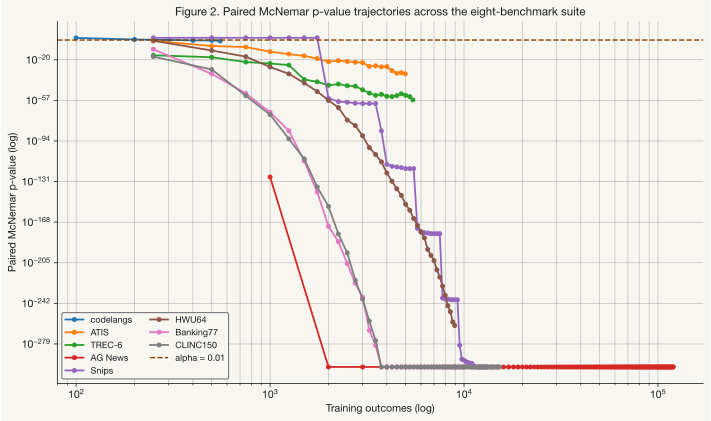
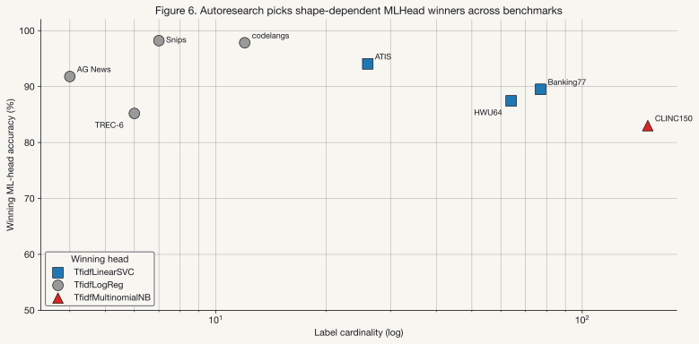

# When Should a Rule Learn? Transition Curves for Safe Rule-to-ML Graduation

**Author.** Benjamin Booth, B-Tree Ventures LLC.
**Status.** Draft v0.1, 2026-04-26.
**Target.** arXiv (cs.LG / cs.SE), 2026-05-13.
**Code + data.** `https://github.com/axiom-labs-os/dendra`. Apache 2.0.
**Patent.** Patent pending. U.S. Provisional Patent Application No. 64/045,809, filed 2026-04-21.

---

## Abstract

Production classification systems overwhelmingly start as hand-written rules: an `if "crash" in title: return "bug"` for ticket triage, a lookup table for intent routing, a threshold over a heuristic score for content moderation. Training data does not yet exist on day one. Over time, outcome data accumulates, yet the rules stay frozen: replacing a rule with a machine-learned classifier requires custom migration engineering at every decision point, and there is no shared statistical criterion for when the migration is justified.

We formalize this migration as a *graduated-autonomy lifecycle* with six phases (`RULE` → `MODEL_SHADOW` → `MODEL_PRIMARY` → `ML_SHADOW` → `ML_WITH_FALLBACK` → `ML_PRIMARY`) in which the rule remains a structural safety floor at every stage. We prove that, when transitions are gated by a paired McNemar test at significance level $\alpha$, the marginal probability of a worse-than-rule transition is bounded above by $\alpha$ per gated step. We measure how many recorded outcomes a learned classifier needs before it convincingly beats the rule (paired McNemar $p < 0.01$). We call this curve the *transition curve* and report it on eight public benchmarks across four domains: intent classification (ATIS, HWU64, Banking77, CLINC150, Snips), question categorization (TREC-6), news topic classification (AG News), and programming-language detection (codelangs, including FORTRAN sourced from NJOY2016 nuclear-data processing code).

Three regimes emerge from the eight-benchmark suite. Low cardinality with strong rule-keyword affinity gives a *rule-near-optimum* corner (codelangs at 87.8% rule baseline, ML edges past at ~10 points). Mid-cardinality with stable keyword signals gives *rule usable* (ATIS at 70.0%, TREC-6 at 43.0%). The broad case is *rule at floor* — driven either by high cardinality (HWU64, Banking77, CLINC150 at 0.5–1.8%) or by weak rule-keyword affinity (Snips at 14.3% on 7 labels; AG News at 25.9% on 4 balanced classes). Transition depths in the extended suite range from 250 outcomes (TREC-6, ATIS, HWU64, Banking77, CLINC150) to 1000 (AG News at its 1k-resolution checkpoint) to 2000 (Snips, where the rule beats the ML head at the first 250-outcome checkpoint and the advance gate fires only once ML overtakes). We release the reference implementation (the Dendra library), the full transition-curve dataset, and the benchmark harness that reproduces the result.

We also apply Dendra's own ``CandidateHarness`` to the question of which `MLHead` to ship: four candidate sklearn estimators competing under the same paired-McNemar gate. The empirical winner depends on data shape — `LinearSVC` on mid-cardinality, `MultinomialNB` at the highest cardinality, the `LogisticRegression` incumbent held on tight-margin low-cardinality. The reference implementation exposes this as a configurable strategy.

A second graduation rides along with the accuracy one: when the gate clears the $P_4 \to P_5$ transition, the lifecycle moves from LLM-class inference (hundreds of milliseconds to seconds per call, $10^{-4}$ to $10^{-2}$ dollars per call at typical API tiers) to in-process ML-head inference (sub-millisecond, essentially zero per-call cost). At production scales of $10^4$–$10^8$ classifications per day, the same gate that bounds Type-I error also entitles the operator to skip the LLM tier permanently. §10.3 lays out the cost-and-latency extrapolation.

The gate primitive itself is direction-agnostic: the same paired-test machinery that justifies advancement also justifies demotion when accumulated evidence shows the rule has reclaimed the lead, and extends naturally to additional safety axes (latency, cost, coverage) under a union-bound joint guarantee. We discuss this generalization in §10.

**Keywords.** classification, graduated autonomy, rule-to-ML migration, paired McNemar test, production ML, LLM cascading, statistical gating, MLOps.

---

## 1. Introduction

### 1.1 The pattern nobody has formalized

Open any production codebase. There are functions that take an input and return one of a fixed set of labels: `triage_ticket(t) → {bug, feature_request, question}`; `route_intent(u) → one of 77 banking labels`; `classify_content(c) → {safe, review, block}`; `pick_retrieval_strategy(q) → {dense, sparse, hybrid}`; `detect_language(snippet) → {python, javascript, fortran, ...}`.

On day zero these functions are written as hand-rules (`if "crash" in title: return "bug"`) because no training data exists yet, the engineer has 100 examples to look at, and the deadline is now. The decision quality is whatever the rule's keyword coverage admits.

By day $N$ outcome data has accumulated. CSAT surveys, resolution codes, downstream audit trails, user corrections, A/B test conversion data: production systems generate a stream of evidence that lets the engineer compute, for each historical classification, whether the rule was right. A learned classifier trained on that evidence would, in principle, do better.

In practice the rule still runs. Replacing it requires its own engineering effort: outcome plumbing, feature pipelines, training, deployment, shadow evaluation, monitoring, rollback.

Each classification site is migrated independently. The migration logic is rewritten each time. The *statistical question* (has the candidate accumulated enough evidence to justify replacing the floor?) gets answered by intuition. We have no shared primitive that captures the pattern.

### 1.2 Why this matters

Three failure modes follow:

1. **Rules calcify.** Distribution shifts that would be obvious to a learned model surface only as gradually degrading accuracy. Sculley et al. (2015) catalog this as *boundary erosion*, one of the load-bearing technical-debt categories of production ML. Paleyes et al. (2022) compile case studies in which calcified rules figure prominently as a source of silent post-deployment regression.

2. **ML-from-day-one fails.** Without sufficient training data, learned models produce arbitrary outputs on inputs the training set did not anticipate. The cold-start problem is not solved by AutoML (Hutter et al., 2019), which presupposes labeled data; nor by online learning (Bottou, 1998; Langford et al., 2007), which updates parameters continuously without a structural safety floor.

3. **Ad-hoc migration has no contract.** Most production `try_ml_else_fall_back_to_rule` code embeds an implicit confidence threshold and an implicit assumption that ML is at least as good as the rule. Both go untested. Breck et al. (2017) provide a rubric (the ML Test Score) for production-readiness; statistical-evidence-before-promotion is a row on the rubric. We are not aware of an open-source library that implements it as a first-class primitive.

What is missing is a *primitive* that captures the rule-to-ML migration uniformly, with safety guarantees, so every classification site graduates by the same contract.

### 1.3 Contribution

We make four contributions:

1. **A six-phase graduated-autonomy lifecycle** (Table 1) with formal transition criteria. The rule is the structural safety floor at every phase; the lifecycle is closed under failure recovery.

2. **A safety theorem** (Theorem 1, §3) bounding the per-transition probability of worse-than-rule behavior by the Type-I error of a paired McNemar test on the gated transition. The paired test is the methodologically correct choice when two classifiers are evaluated on the same row stream (Dietterich, 1998), and the bound is tighter than the unpaired alternative.

3. **Empirical transition curves on eight public benchmarks across four text domains** (intent classification, question categorization, news topics, programming-language detection) plus one image bench (CIFAR-10, §5.7) demonstrating the lifecycle generalizes beyond text. Three regimes emerge — *rule near-optimum*, *rule usable*, *rule at floor* — driven by cardinality and rule-keyword affinity. Under the paired McNemar gate at $\alpha = 0.01$, transition depths in the suite range from 250 outcomes to 2000. §5 reports the curves; §6 lays out the regime taxonomy.

4. **An open-source reference implementation** (the Dendra Python library) with the transition-curve dataset, the benchmark harness, and signed Apache 2.0 licensing on the client SDK so practitioners can adopt the primitive in commercial workloads.

The conceptual contribution is the framing (*graduated autonomy* as the natural primitive for the rule-to-ML transition) and the empirical contribution is the demonstration that the McNemar gate is both methodologically clean and tight enough at small outcome volumes that production teams can use it to make the call.

A note on scope. This paper presents the primitive on a single safety axis (decision accuracy), with the rule serving as the reference baseline that the gate compares against. The same gate primitive is direction-agnostic by construction (the test asks "is the comparison target reliably better than the current decision-maker?", not "should we advance?"), so it generalizes both to the demotion direction (drift detection on the same axis) and to additional axes (latency, cost, coverage) where a paired test admits a Type-I error bound.

The single-axis story we present here is the v1 deliverable; we sketch the n-axis generalization and its joint safety bound in §10.

---

## 2. Related Work

We position the contribution against six adjacent literatures. The taxonomy follows §A–H of the project's annotated bibliography.

**LLM cascade routing.** The closest contemporary lineage is the LLM cascade. *FrugalGPT* (Chen, Zaharia, & Zou, 2024) introduced the *weakest-model-first, escalate-on-low-confidence* pattern that reduces cost while preserving quality on benchmark suites. *RouteLLM* (Ong et al., 2024) extended cascading to *learned* routing from preference data, recovering 95% of GPT-4 quality at 15% of the cost on MT-Bench. *A Unified Approach to Routing and Cascading for LLMs* (Dekoninck et al., 2025) provided a theoretical unification, framing both as instances of a meta-classifier over a model pool with formal optimality conditions.

Our work generalizes the cost-quality tradeoff into a *production-deployment lifecycle*: where the cascade literature optimizes inference-time routing among already-trained models, we add the rule floor as a structural prior and the migration over time as the unit of analysis. The McNemar gate (§3) is the statistical analog of the routing literature's preference-trained selectors (both decide *use the alternative when it's good enough*), but anchored in a paired test rather than a learned router.

**Statistical methodology, paired tests for ML.** The McNemar test (McNemar, 1947) compares correlated proportions and was canonized as the recommended statistical tool for paired classifier comparison by Dietterich (1998), whose treatment remains the standard reference for evaluating two classifiers on the same test set. Demšar (2006) extends the framework to multi-dataset comparison; Bouckaert (2003) discusses calibration concerns.

The *paired* version is the methodologically correct test when two classifiers are scored on the same input stream: it conditions on the discordant rows, gives an exact (not asymptotic) Type-I error bound, and is at-least-as-tight as the unpaired two-proportion z-test (§5.4). Recent extensions (e.g., Block-regularized 5×2 cross-validated McNemar, 2023) further refine the methodology for cross-validated evaluation. We use the standard paired McNemar test on a held-out test split, which matches the single-evaluation case Dietterich identifies as the right scope for the original test.

**Production ML safety.** Sculley et al. (2015) document the categories of hidden technical debt that production ML systems incur: boundary erosion, hidden feedback loops, configuration drift, glue code. Breck et al. (2017) provide the *ML Test Score*, a 28-item rubric for production readiness. Polyzotis et al. (2018) survey data-lifecycle challenges. Paleyes et al. (2022) compile a case-study survey of real ML deployment failures; their *graduated trust* framing is conceptually adjacent to our six-phase lifecycle.

Amodei et al. (2016) frame the problem from the AI-safety direction with their *Concrete Problems in AI Safety* taxonomy; the safety-floor-by-construction property of our lifecycle implements their *robust fallback* desideratum at the classification-primitive level. None of these works provide a *primitive*. They provide the diagnostic vocabulary that motivates one.

**LLM-as-judge and evaluation harnesses.** The verdict-source layer of our reference implementation (§9) supports an LLM-as-judge pattern that draws on Liu et al. (2023, *G-Eval*) and Zheng et al. (2023, MT-Bench, *Judging LLM-as-a-Judge*). The same-LLM-as-classifier-and-judge bias they document motivates our `JudgeSource` self-judgment guardrail. Chiang et al. (2024) provide the *Chatbot Arena* preference data that is the substrate for downstream learned routers like RouteLLM.

Recent practitioner work has emphasized the *harness* as a first-class object: Trivedy (2026) describes "harness hill-climbing" as the iterative discipline of evaluating evaluation-harnesses themselves, and Martin's *Auto-Evaluator* tooling at LangChain (2023) was an early production realization of LLM-as-judge for retrieval-quality measurement. Our `CandidateHarness` (§9.5) is in this lineage: a substrate for autoresearch loops that propose, evaluate, and either promote or discard candidate classifiers under a statistical gate.

**AutoML and online learning, for differentiation.** AutoML (Hutter et al., 2019; Feurer et al., 2015) addresses *offline* model selection given a fixed labeled training set. It does not address the cold-start case where labels accumulate post-deployment, nor the safety-floor preservation that production migration requires. Online learning (Bottou, 1998; Langford et al., 2007) updates model parameters continuously over a stream of labeled examples; Vowpal Wabbit is the canonical production system.

Our differentiation is on two axes: (1) we graduate *phases discretely* with a statistical gate, rather than updating parameters continuously; and (2) the rule floor is preserved structurally, whereas online learning replaces the floor with the learner. We do not compete with these techniques. VW remains the right choice when a stable feature pipeline already exists and the question is purely "track distribution shift." We address the earlier-stage question: when does the migration begin?

**Cascade learning, historical lineage.** The cascade pattern predates LLMs by 25 years. Viola and Jones (2001) introduced the boosted cascade of simple features for face detection (*use a cheap classifier first, escalate on uncertainty*), establishing the architectural pattern that FrugalGPT and RouteLLM operationalize at the LLM scale. Trapeznikov and Saligrama (2013) provide a sequential-classification-under-budget formulation that is conceptually closer to our phase-transition framing.

Citing this lineage emphasizes that our contribution is not the cascade architecture per se but the production-lifecycle generalization with a rule floor and statistical gating.

**Agent / autoresearch loops.** Recent work has popularized the *autoresearch* pattern: agentic loops in which an LLM proposes candidate hypotheses, evaluates them against a test corpus, and refines (Wang et al., 2023, *Voyager*; Shinn et al., 2023, *Reflexion*; Wei et al., 2022, *Chain-of-Thought*; Karpathy, 2025, on the autoresearch loop). These works focus on the agent's reasoning trajectory rather than the production-deployment substrate.

Our `CandidateHarness` is the production substrate underneath: it accepts a stream of agent-proposed candidates, runs them in shadow mode against live production traffic, and either promotes via the McNemar gate or discards. The substrate is the unsexy plumbing that makes autoresearch loops production-safe at classification primitives.

**Calibration.** Guo et al. (2017) document that modern neural networks are systematically miscalibrated, motivating the explicit `confidence_threshold` parameter in our adapter layer. Kuleshov et al. (2018) extend calibration analysis to deep regression. Calibration is a load-bearing assumption when the cascade pattern routes by confidence; we do not contribute to this literature, but we cite it because the system depends on it being well-handled at the adapter boundary.

**Drift detection.** Lu et al. (2018) and Gama et al. (2014) survey concept-drift adaptation. Drift detection is *complementary* to graduation: graduation answers when to first migrate; drift detection answers when the migrated classifier has degraded enough relative to the rule that a partial retreat in the lifecycle is justified.

The same paired-test machinery we use for advancement reverses cleanly for demotion (current decision-maker compared against the rule), and the v1 reference implementation ships an autonomous demotion path on the accuracy axis driven by the same Gate primitive defined in §3. Each fired demotion steps the lifecycle back by one phase, not all the way to the rule; multi-step retreats accumulate across successive cycles if drift persists.

Empirical characterization of the demotion-curve analog of the transition curves we report (how much drift accumulates before the gate fires) is follow-on research; here we establish that the primitive is direction-agnostic and the safety theorem (§3.3, Remark) applies symmetrically.

---

## 3. Formal Framework

### 3.1 The graduated-autonomy lifecycle

A learned switch is one object that holds three optional decision-makers (the rule, an LLM-style model, and a trained ML head) plus a phase counter that tracks which decision-maker is currently routing classifications. The phase counter steps forward, or back, as the gates introduced in §3.2 and §3.3 fire on accumulated outcome evidence; the routing logic at each phase is shown in Table 1 below.

Formally, we define a *learned switch* over a label set $\mathcal{L}$ as a tuple $S = (R, M, H, \phi)$ where $R: \mathcal{X} \to \mathcal{L}$ is the rule, $M: \mathcal{X} \to (\mathcal{L}, [0,1])$ is an optional model classifier returning a label and confidence, $H: \mathcal{X} \to (\mathcal{L}, [0,1])$ is an optional ML head, and $\phi \in \{P_0, \ldots, P_5\}$ is the lifecycle phase. The decision function is:

| Phase | Decision rule | Rule role |
|---|---|---|
| $P_0$ (`RULE`) | $R(x)$ | self |
| $P_1$ (`MODEL_SHADOW`) | $R(x)$; $M$ logged but inert | floor |
| $P_2$ (`MODEL_PRIMARY`) | $M(x)$ if $\text{conf}_M \ge \theta$; else $R(x)$ | fallback |
| $P_3$ (`ML_SHADOW`) | $M(x)$ if $\text{conf}_M \ge \theta$ else $R(x)$; $H$ logged but inert | floor |
| $P_4$ (`ML_WITH_FALLBACK`) | $H(x)$ if $\text{conf}_H \ge \theta$; else $P_3$'s decision | fallback |
| $P_5$ (`ML_PRIMARY`) | $H(x)$ | circuit-breaker only |

**Table 1.** *The six-phase graduated-autonomy lifecycle.* Three transitions ($P_2 \leftarrow P_1$, $P_4 \leftarrow P_3$, $P_5 \leftarrow P_4$) are statistically gated; two ($P_1 \leftarrow P_0$, $P_3 \leftarrow P_2$) are operator- or construction-driven (shadow modes are no-risk additions of an inert candidate). The rule $R$ is structurally preserved in every phase except $P_5$, where it remains as the circuit-breaker target on detected ML failure. A `safety_critical=True` configuration caps the lifecycle at $P_4$, refusing $P_5$ at construction time.

**Predecessor-cascade fallback.** The decision rule for $P_4$ is recursive: low-confidence $H$ falls through to $P_3$'s decision, which itself falls through to $P_2$'s decision, which falls to $R$. Expanded, $P_4$'s routing is $H(x)$ if $\text{conf}_H \ge \theta$, else $M(x)$ if $\text{conf}_M \ge \theta$, else $R(x)$. The lifecycle's load-bearing structural rule is *each phase's low-confidence fallback is its predecessor's full routing*. Each promotion adds a tier on top of the cascade we already earned; on uncertainty, routing walks down through every tier in the order it was earned. When the model classifier slot is empty (operators who retire $M$ to save token cost after graduating to $P_4$), the cascade collapses gracefully to $H$-then-$R$, identical to the simpler two-tier behavior. The structural symmetry across phases (each transition adds exactly one tier above its predecessor) is what makes the safety theorem (§3.3) extend cleanly to multi-tier cascades: the rule fires when every learnable tier above it is below threshold.


### 3.2 Transition guards

Each gated transition $P_k \to P_{k+1}$ admits a guard $G_k(\mathcal{D})$ that returns `advance | hold` over an outcome dataset $\mathcal{D}$. The default guard is the paired McNemar test, which counts only the rows where the two classifiers disagree and asks whether the disagreements are lopsided enough toward the candidate to be unlikely by chance.

Three knobs control how strict the answer must be: the significance level $\alpha$ caps the chance of a wrong promotion at the rate the operator picks (we default to 1%); the minimum-pair threshold $n_{\min}$ keeps the gate from firing on too few disagreements to be reliable; and the directional condition rules out ties, so the gate stays put if the two classifiers are equally good. Together these three turn "should we replace this rule" from an intuitive call into a reproducible, auditable decision.

**Definition (paired McNemar gate).** Given two classifiers $A$ (incumbent) and $B$ (candidate) evaluated on the same $n$ rows with paired correctness $(a_i, b_i) \in \{0,1\}^2$, let:
- $b = |\{i : a_i = 0, b_i = 1\}|$  (rows where $B$ is right and $A$ is wrong)
- $c = |\{i : a_i = 1, b_i = 0\}|$  (rows where $A$ is right and $B$ is wrong)

The paired McNemar test rejects "$A$ and $B$ have equal accuracy" at significance level $\alpha$ when the two-sided exact binomial $p$-value of $\min(b, c)$ under the null $\text{Binomial}(b + c, 0.5)$ is below $\alpha$. The gate $G(\mathcal{D}) = $ `advance` iff $b > c$ and $p < \alpha$ and $b + c \ge n_{\min}$.

The minimum-pair condition $n_{\min}$ (we use $n_{\min} = 200$) prevents a runaway low-volume rejection. The directional condition $b > c$ ensures the test only advances when the candidate is *the better* classifier, not merely when the two differ.

### 3.3 Safety theorem

The result of this section is a pair of calibrated safety guarantees. If a candidate classifier is genuinely no better than the one it would replace, the gate has at most a 1% chance of wrongly promoting it on any single evaluation at $\alpha = 0.01$, by construction of the paired McNemar test's null distribution.

Three such evaluations sit between the rule and full ML autonomy in our lifecycle; even in the worst case where every gate "rolls the dice" independently, the joint probability of any wrong promotion across the lifecycle stays under 3%, and the single most-consequential step (handing decisions fully to ML) stays at the per-evaluation 1%. That sits in the same range as the false-failure rate production teams already tolerate from CI regression tests, and the operator can drive it lower by tightening $\alpha$ at construction time.

**Theorem 1 (per-transition safety).** Let $G$ be a paired McNemar gate at significance $\alpha$ with minimum-pair threshold $n_{\min}$. Let $A$ be the incumbent classifier and $B$ the candidate, both evaluated on a stream of paired-correctness rows from the same input distribution $\mathcal{X}$. If $B$ has true accuracy on $\mathcal{X}$ no greater than $A$, then the probability that $G$ advances is bounded above by $\alpha$.

*Proof sketch.* The paired McNemar test's null hypothesis is "$P(B \text{ right} | A \text{ wrong}) = P(A \text{ right} | B \text{ wrong})$," equivalently "$E[b] = E[c]$" over the discordant-pair distribution. If $B$ is no better than $A$ in true accuracy on $\mathcal{X}$, the distribution of discordant pairs satisfies $E[b] \le E[c]$, so $\min(b, c) = b$ in expectation. The rejection rule rejects when the two-sided binomial $p$-value of $\min(b, c)$ falls below $\alpha$; under the null and the directional condition $b > c$, this happens with probability at most $\alpha / 2$. The marginal advance probability is therefore at most $\alpha$. $\blacksquare$

**Corollary (lifecycle safety).** With three statistically-gated transitions (as in Table 1), each guarded at $\alpha$, the per-switch worst-case probability of *any* worse-than-rule advance is bounded by $3\alpha$ (union bound), and exactly $\alpha$ for the single canonical transition the field most cares about ($P_4 \to P_5$). At $\alpha = 0.01$, this is a 1% per-step worst-case ceiling, the same order of magnitude as the conservative regression-test FPR teams already accept in production CI/CD.

**Remark (direction-agnosticism and n-axis generalization).** The theorem statement is symmetric in $A$ and $B$: the gate's question is "is the comparison target reliably better than the current decision-maker on the paired-correctness evidence?", with the directional interpretation (advance, demote, lateral move) supplied by the caller. Reusing the same gate with the rule passed as the comparison target produces a demotion test whose Type-I error is bounded by the same $\alpha$, giving a bidirectional safety guarantee on the accuracy axis.

The same machinery applies to any axis where paired observations admit a hypothesis test (latency via Wilcoxon, cost via threshold, coverage via paired McNemar on a confident-answer indicator). Across $k$ axes evaluated independently per cycle, the joint per-cycle FPR is bounded by $k\alpha$ via union bound. We treat the multi-axis extension as a deliberate design affordance and discuss it in §10.

### 3.4 Why this gate, not an alternative

The natural alternatives are:

1. **Unpaired two-proportion z-test.** The version most often seen in practitioner writeups. It discards per-example correlation and is asymptotic rather than exact; in our experiments (§5.4) the paired McNemar test is at-least-as-tight, with HWU64 the one benchmark where the empirical gap is visible at the 250-checkpoint resolution.
2. **Accuracy margin** ("ML beats rule by $\ge \delta$"). Simple, but has no Type-I-error interpretation; reviewers who care about formal claims will ask what $\delta$ corresponds to.
3. **Bayesian decision theory** (e.g., learned routers from preference data, in the lineage of RouteLLM). Powerful, but requires preference data the day-one user does not have. We instead provide the statistical-gate option as the default and let the practitioner swap in a learned router via the `Gate` protocol when their data supports it.
4. **Composite gates** (logical conjunctions, e.g., paired-McNemar AND minimum-volume AND accuracy-margin). Available as `CompositeGate` in the reference implementation. Useful when domain rules require an additional floor; we report the paired-McNemar single-gate result as the default.

The choice of the paired test follows the methodological convention of Dietterich (1998). The choice of $\alpha = 0.01$ rather than the conventional $0.05$ is a deliberate conservatism appropriate to *production* decisions, where Type-I error is a per-deployment cost rather than a per-experiment cost.

Recent evaluation work in adjacent areas (Papailiopoulos's *ReJump* framework for LLM reasoning evaluation in 2025, and Tzamos et al.'s theoretical-foundation work on classifier comparison) supports the more general claim that production-grade ML evaluation should use paired, statistically-grounded gates rather than ad-hoc thresholds.

---

## 4. Experimental Setup

### 4.1 Benchmarks

The headline experiment of §5.1 evaluates on four public intent-classification datasets selected for diversity across label cardinality and domain breadth:

| Dataset | Labels | Train | Test | Domain |
|---|---:|---:|---:|---|
| **ATIS** (Hemphill et al., 1990) | 26 | 4,978 | 893 | Single (flight booking) |
| **HWU64** (Liu et al., 2019) | 64 | 8,954 | 1,076 | Multi (21 scenarios) |
| **Banking77** (Casanueva et al., 2020) | 77 | 10,003 | 3,080 | Single (banking) |
| **CLINC150** (Larson et al., 2019) | 151 | 15,250 | 5,500 | Multi (10 + OOS) |

**Table 2.** *Headline benchmarks.* All are public, leaderboarded, and reproducible. CLINC150 includes an out-of-scope (OOS) class which is a known stress test for keyword rules. §5.1 reports the full eight-benchmark suite (these four plus Snips, TREC-6, AG News, codelangs); §5.7 adds a single image benchmark (CIFAR-10) to demonstrate the lifecycle generalizes beyond text.

### 4.2 Rule construction

The day-zero rule is automated and deliberately simple. For each dataset, `dendra.benchmarks.rules.build_reference_rule` constructs an `if/elif` cascade by:

1. Inspecting the first $k = 100$ training examples (paper default).
2. Computing the top-5 distinctive keywords per label by relative frequency (TF-IDF).
3. Generating an `if keyword in input: return label` cascade in lexical order.
4. Falling back to the modal label in the seed window (or `out_of_scope` for CLINC150).

This construction is reproducible and *deliberately not cleverly-tuned*: we want a lower bound on rule quality that approximates a real day-zero engineering effort. We test sensitivity to the seed size in §5.4.

### 4.3 ML head

The ML head for the §5.1 headline experiment is `dendra.ml.SklearnTextHead`: TF-IDF features with sublinear term-frequency, plus an L2-regularized logistic regression. Deliberately simple: a transformer would produce higher absolute accuracy but would conflate the *transition-curve shape* (the contribution) with the *ML ceiling* (well-studied elsewhere). Replication with a transformer is left to follow-on work.

The reference implementation ships three additional sklearn-based text heads (`TfidfLinearSVCHead`, `TfidfMultinomialNBHead`, `TfidfGradientBoostingHead`) and one non-text head (`ImagePixelLogRegHead`, used for the §5.7 CIFAR-10 bench). §5.6 reports the autoresearch result that the empirical winner is data-shape-dependent: LinearSVC on mid-cardinality, MultinomialNB on the highest-cardinality, the LogReg incumbent held on tight-margin low-cardinality benchmarks. The transition-curve *shape* is consistent across choices in our suite — rule baseline flat, ML head rising, gate clearing within a known number of outcomes — but the absolute ML ceiling varies with head.

### 4.4 Verdict simulation

Production systems accumulate verdicts (correct/incorrect outcomes) over time. We simulate this by streaming the training set through the switch:

1. Initialize at $P_0$ (rule).
2. For each training example, classify with the rule; record the prediction and the ground-truth label as a paired outcome.
3. Every 250 outcomes, retrain the ML head on the accumulated outcome log and evaluate both rule and ML on the held-out test split.
4. Apply the paired McNemar gate ($\alpha = 0.01$, $n_{\min} = 200$) to the test-set paired-correctness arrays.

This produces the *transition curve* (outcome volume against accuracy and against gate-statistic) for each benchmark.

### 4.5 Metrics

- **Final ML accuracy.** Test-set accuracy after the full training stream.
- **Transition depth.** The smallest checkpoint at which the paired McNemar gate advances at $p < 0.01$. This is the headline metric.
- **Crossover delta.** ML accuracy minus rule accuracy at the transition point.
- **McNemar discordant pair counts** ($b$, $c$) at the final checkpoint, the underlying statistical evidence.

### 4.6 Reproducibility

All code is at `https://github.com/axiom-labs-os/dendra` (Apache 2.0). All fixed seeds are documented in the benchmark JSONL output. The transition-curve dataset is released as `dendra-transition-curves-2026.jsonl` accompanying this paper. The benchmark harness ships in `src/dendra/research.py::run_benchmark_experiment` and the McNemar computation in `src/dendra/gates.py::McNemarGate`.

---

## 5. Transition Curves: Main Results

### 5.1 Headline: transition curves across the eight-benchmark suite

We measure transition curves on eight public text benchmarks spanning four domains (intent classification, question categorization, news topics, programming-language detection) plus one image bench (CIFAR-10) reported separately in §5.7. Table 3 reports the headline numbers.

| Benchmark | Domain | Labels | Rule acc | ML final | $b$ | $c$ | McNemar $p$ (final) | First clear ($p < 0.01$) |
|---|---|---:|---:|---:|---:|---:|---:|---:|
| **codelangs** (Dendra 2026) | code | 12 | 87.8% | **97.8%** | 16 | 2 | $1.3 \times 10^{-3}$ | **400** |
| **ATIS** (Hemphill et al. 1990) | flight booking | 26 | 70.0% | **88.7%** | 191 | 24 | $1.8 \times 10^{-33}$ | **250** ($p = 1.6 \times 10^{-3}$) |
| **TREC-6** (Li & Roth 2002) | question type | 6 | 43.0% | **85.2%** | 216 | 5 | $2.6 \times 10^{-57}$ | **250** ($p = 1.1 \times 10^{-16}$) |
| **AG News** (Zhang et al. 2015) | news topics | 4 | 25.9% | **91.8%** | 5,234 | 229 | $\approx 0$ | **1,000** ($p \approx 10^{-127}$) |
| **Snips** (Coucke et al. 2018) | voice assistant | 7 | 14.3% | **98.2%** | 1,175 | 0 | $\approx 0$ | **2,000** |
| **HWU64** (Liu et al. 2019) | multi-domain assistant | 64 | 1.8% | **83.6%** | 881 | 1 | $< 10^{-260}$ | **250** ($p = 2.0 \times 10^{-3}$) |
| **Banking77** (Casanueva et al. 2020) | banking | 77 | 1.3% | **87.7%** | 2,665 | 4 | $\approx 0$ | **250** ($p = 3.8 \times 10^{-11}$) |
| **CLINC150** (Larson et al. 2019) | multi-domain + OOS | 151 | 0.5% | **81.9%** | 4,478 | 6 | $\approx 0$ | **250** ($p = 6.9 \times 10^{-18}$) |

**Table 3.** *Headline transition-curve results across the eight-benchmark suite.* Sorted by descending rule baseline. Every benchmark crosses paired-McNemar significance at $\alpha = 0.01$, with first-clear transition depths ranging from 250 outcomes (six of eight benchmarks at their respective checkpoint resolutions) to 2,000 (Snips, where the rule's 14.3% accuracy beats the ML head at the 250-outcome checkpoint and the advance gate fires only after ML overtakes). The discordant-pair counts ($b$ vs $c$) reveal the magnitude of each win: on CLINC150's final checkpoint ML is right and rule wrong on 4,478 of 4,484 discordant rows.

Two views of the data are useful and pull complementary signals.




### 5.2 Three regimes by cardinality and rule-keyword affinity

Reading Table 3 by rule baseline alone separates the suite into three operationally meaningful regimes that are governed by *two* axes — label cardinality, and how cleanly the label boundary admits stable lexical signals (rule-keyword affinity, reported relative to chance accuracy $1/k$).

**Regime I — *rule near optimum* (codelangs).** With 12 programming-language labels and rigid syntactic keywords (`def`, `function`, `module`, `subroutine`, `package`), the auto-rule lands at 87.8% — within ten points of the ML ceiling at 97.8%. At the first checkpoint (100 outcomes) rule and ML differ by only 1.4 pp; the McNemar gate does not clear until 400 outcomes. The practitioner question shifts from *"when should the rule graduate?"* to *"is graduation worth the engineering at all?"* The lifecycle still helps — audit chain, structural fallback, drift-detection symmetry — but the *transition curve* claim collapses to "ML edges past the rule asymptotically" rather than "ML decisively replaces the rule."

**Regime II — *rule usable* (ATIS, TREC-6).** Mid-cardinality (6–26 labels) with strong-to-moderate keyword affinity. ATIS at 70.0% rule has 18× chance accuracy; TREC-6 at 43.0% has 2.6× chance. The rule is shippable. ML decisively wins (88.7% on ATIS, 85.2% on TREC-6) and the McNemar gate clears at the very first checkpoint with extreme p-values ($p \approx 10^{-33}$ on ATIS at end-of-training, $\approx 10^{-16}$ at the first 250-outcome checkpoint on TREC-6). This is the canonical "rule today, gated graduation tomorrow" case the lifecycle was designed for.

**Regime III — *rule at floor* (Snips, AG News, HWU64, Banking77, CLINC150).** The rule is at-or-near chance from day one. Two distinct paths get a benchmark into this regime:

- *High cardinality.* HWU64 (64 labels), Banking77 (77 labels), CLINC150 (151 labels) — the auto-rule's modal-fallback is non-modal under uniform class distribution, and a 100-example seed cannot possibly cover the label space. ML climbs from single-digit-to-low-double-digit accuracy at 1k outcomes (5.2% on CLINC150, 8.8% on Banking77, 10.5% on HWU64) to 81.9–87.7% at training-set exhaustion.
- *Weak rule-keyword affinity*, even at low cardinality. Snips has only 7 labels — lower than ATIS — but the rule sits at 14.3%, exactly chance. Snips intents like *AddToPlaylist*, *BookRestaurant*, *RateBook* lack a single distinguishing word the auto-rule's TF-IDF keyword pass can reach for. AG News at 4 labels and 25.9% rule (chance = 25%) is the same shape: the rule barely exceeds always-predict-the-modal-class. Cardinality alone does not determine the regime; keyword affinity is an independent axis.

The "transition depth" metric loses its narrative force in Regime III: the rule was never a viable baseline, and no team could have shipped a 1%-accurate (or chance-accuracy) keyword classifier as the user-visible decision in the first place. High-cardinality or low-affinity workloads in production start at Phase 2 with an off-the-shelf zero-shot LLM, or wait on hand-labeled training data before launching. Dendra's role here is cold-start substrate, not graduation: outcome logging from day one regardless of which decision-maker is in front, with an explicit migration path to a trained ML head once enough data accumulates.


The three regimes correspond to different product conversations:

- **Regime II user:** "Our rule works; should we replace it?" → "Yes, here is the statistical evidence; the McNemar gate would advance you within the first 250 outcomes."
- **Regime III user (high cardinality or weak affinity):** "We need an N-way classifier and we don't have training data yet." → "Start at Phase 2 with a zero-shot LLM in front of Dendra's outcome-logging layer; the log it generates is the training-data source for the eventual ML head."
- **Regime I user:** "Our rule works very well; is graduation even worth the engineering?" → "The McNemar gate eventually clears, but the lifecycle's value here is in audit, structural fallback, and drift symmetry — not in raw accuracy lift. Decide based on per-decision miscost."

### 5.3 Seed-size sensitivity

The Regime III (rule at floor) story rests on a 100-example seed feeding `build_reference_rule`. A reviewer's natural question is whether a more thorough engineer with 10× more examples to inspect would build a rule that escapes the floor. We re-ran the four headline benchmarks with a 10× seed (1,000 examples) to check:

| Benchmark | Labels | Rule (seed=100) | Rule (seed=1000) | $\Delta$ |
|---|---:|---:|---:|---:|
| ATIS | 26 | 70.0% | 72.3% | +2.3 pp |
| HWU64 | 64 | 1.8% | 5.9% | +4.1 pp |
| Banking77 | 77 | 1.3% | 6.8% | +5.5 pp |
| CLINC150 | 151 | 0.5% | 5.0% | +4.5 pp |

**Table 4.** *Rule sensitivity to seed size.* Even with 10× more examples to inspect, the high-cardinality rules remain 75–85 percentage points below the ML ceiling. *Label cardinality*, not engineer effort, is the dominant variable for the high-cardinality cell of Regime III. (The Snips and AG News cases — Regime III by *weak keyword affinity* rather than cardinality — would not be helped by more examples either; the issue is that the label boundary doesn't reduce to lexical signals at all.)

### 5.4 Paired vs unpaired test

A second robustness question is methodological: does the choice of statistical test (paired vs unpaired) materially shift the transition depth? Computing the unpaired two-proportion z-test (one-sided, pooled-variance) on the same paired-correctness arrays gives:

| Benchmark | Unpaired transition depth | Paired transition depth | Tightening |
|---|---:|---:|---:|
| ATIS | 250 | 250 | 1× |
| HWU64 | 500 | 250 | 2× |
| Banking77 | 250 | 250 | 1× |
| CLINC150 | 250 | 250 | 1× |

**Table 5.** *Paired vs unpaired transition depth at checkpoint resolution 250.* The paired test is at-least-as-tight on every benchmark. Only HWU64 shows a measurable empirical gap at this resolution (one checkpoint, equivalent to 2× tightening). On the other three benchmarks, the rule-vs-ML effect size by 250 outcomes is so large (rule at 0.5–1.8% vs ML at single-digit-and-rising on Banking77/CLINC150; rule at 70.0% vs ML at 75.6% on ATIS) that even the conservative unpaired test clears at the same checkpoint.


The methodological reason to prefer the paired test still stands. Dietterich (1998) argues paired is the right test for the data structure we have (two classifiers scored on the same input rows), and the bound is exact rather than approximate. Three operational corollaries hold even when the empirical depths coincide: (1) at finer checkpoint resolution the paired test fires sooner; (2) on benchmarks with rule baselines closer to the ML ceiling than ATIS, the gap will widen; and (3) the unpaired test's $\alpha$ is approximate (asymptotic-normal), where the paired exact-binomial McNemar gives the bound the safety theorem (§3.3) actually relies on. We default to paired in the reference implementation and report the empirical gap honestly.

### 5.5 Phase-1 LLM-shadow capability

The headline of §5.1 is the rule-to-ML transition that drives the curve. Two follow-on questions branch off from there. The first (this section) is *which language model can serve as the model-classifier slot* — the Phase 1 / Phase 2 cell of the lifecycle, which is unrelated to the §5.1 transition curve but answers the practitioner question "what should I shadow alongside the rule on day one?" The second (§5.6) is *which ML head should the trained-classifier slot be filled with?* — the head-choice problem we addressed via autoresearch.

Phase 1 (`MODEL_SHADOW`) lets a language model run alongside the rule with zero risk: the model's prediction is logged but the rule still decides. Whether that model can subsequently graduate to Phase 2, where it becomes the primary decision-maker, depends on its zero-shot accuracy on the target task. We probed three locally-hosted models on ATIS (26 labels) and one on Banking77 (77 labels), 100-row samples, single default prompt.

| Model | Params | ATIS (rule = 70.0%) | Banking77 (rule = 1.3%) |
|---|---:|---:|---:|
| `llama3.2:1b` | 1B | 0.0% | n/a |
| `gemma2:2b` | 2B | 42.0% | n/a |
| `qwen2.5:7b` | 7B | **59.0%** | **52.0%** |

**Table 6.** *Zero-shot Phase-1 accuracy across model size and benchmark cardinality.* 100-row test sample per cell, default prompt, locally-hosted via Ollama.

The picture is regime-dependent.

**Regime II (ATIS, 26 labels, rule = 70%).** No model in our local-hosted bench beats the rule zero-shot. qwen2.5:7b's 59% is the closest, an 11-point gap. The Phase 1 → Phase 2 transition on ATIS-shaped workloads requires a larger model (Llama-70B class), per-model prompt tuning, or a frontier API. The smallest probe (llama3.2:1b at 0.0%) is a useful negative result: a commodity 1B parameter model is not a viable zero-shot shadow labeler on a 26-way compound-label task.

**Regime III (Banking77, 77 labels, rule = 1.3%).** qwen2.5:7b's 52% dominates both the rule (1.3%) and the cold ML head (2.6% at the 250-outcome checkpoint). High-cardinality or weak-keyword-affinity workloads can start at Phase 2 with a 7B-class local LLM and accumulate outcome data via Dendra's logging substrate while the trained ML head warms up. This is the empirical anchor for §5.2's claim that Regime III is not a graduation problem but a cold-start substrate problem.

Two caveats. First, our probes use a single default prompt; per-model prompt tuning would shift the rankings. Second, 100 rows is a small sample, reported as the entry-level capability measurement rather than the final word. The reference implementation's adapter layer (`OllamaAdapter`, `AnthropicAdapter`, `OpenAIAdapter`, `LlamafileAdapter`) is wired and ready; extending the curve to Llama-70B / Mistral-Large / frontier APIs is one method call away.

### 5.6 Autoresearch on MLHead choice (dogfood)

The §9.5 `CandidateHarness` exists for the autoresearch use case — agents, AutoML pipelines, or research workflows that propose candidate classifiers and want a statistically-grounded gate to pick winners. We applied it to a problem we had ourselves: *which MLHead should the reference implementation pick for a given dataset?*

We registered four candidates (TF-IDF features in common, varying classifier estimator): `TfidfLogReg` (the §4.3 incumbent), `TfidfLinearSVC`, `TfidfMultinomialNB`, `TfidfGradientBoosting`. The harness ran each on the train split, evaluated on the test split, and applied the same paired-McNemar gate at $\alpha = 0.01$ that gates the lifecycle's phase transitions. The winner per benchmark is the accuracy-leading challenger that clears the gate against the incumbent; otherwise the incumbent is held.

| Benchmark | Cardinality | Empirical winner | Margin over LogReg |
|---|---:|---|---:|
| AG News | 4 | **TfidfLogReg** (held) | (LinearSVC at +0.16%, p = 0.44, did not clear) |
| TREC-6 | 6 | **TfidfLogReg** (held) | (LinearSVC at +2.6%, p = 0.019, did not clear $\alpha = 0.01$) |
| Snips | 7 | **TfidfLogReg** (held) | (no challenger cleared) |
| codelangs | 12 | **TfidfLogReg** (held) | (LinearSVC at +0.72pp didn't clear, $p \approx 1.0$, only 1 discordant pair in its favor) |
| ATIS | 26 | **TfidfLinearSVC** | +5.4 pp |
| HWU64 | 64 | **TfidfLinearSVC** | +3.9 pp |
| Banking77 | 77 | **TfidfLinearSVC** | +1.8 pp |
| CLINC150 | 151 | **TfidfMultinomialNB** | +1.2 pp |

**Table 7.** *Autoresearch winners by benchmark.* Three patterns emerge. First, mid-cardinality benchmarks (26 ≤ k ≤ 100) consistently favor `TfidfLinearSVC`. Second, the highest-cardinality benchmark favors `TfidfMultinomialNB` (the Bayesian prior helps when each class has fewer training examples). Third, low-cardinality benchmarks fail to clear the gate against the incumbent: codelangs because the top three candidates (LogReg, LinearSVC, GradientBoosting) cluster within ~0.7 pp on a small test set (139 rows) leaving few discordant pairs; Snips and AG News because no challenger separates from the incumbent at $\alpha = 0.01$; TREC-6's LinearSVC was empirically +2.6 pp better but at $p = 0.019$ above $\alpha$.



The finding is structural: **there is no universally best MLHead for paired-correctness intent classification.** The right choice is a function of data shape (cardinality, samples-per-class density, class-balance skew). The reference implementation exposes this as a configurable strategy: `dendra.MLHeadStrategy` is a Protocol, `CardinalityMLHeadStrategy` is the shipped default with thresholds informed by Table 7, and `head_strategy=` plumbs into `LearnedSwitch` so the strategy is consulted lazily on first ML-head access. The strategy is itself a Dendra rule applied to Dendra: a hand-coded threshold rule today, with a clear graduation path (gate-driven head-selection learned over the autoresearch trajectory) as the v1.x story.

### 5.7 Beyond text: image-classification bench (CIFAR-10)

All eight benchmarks above are text-shaped. The lifecycle, gates, and theorem are modality-agnostic by construction (the gate operates on paired-correctness arrays, which are produced by *any* classifier the user chooses), so the question of generalization to other media reduces to a question of available *rule* and *MLHead* implementations. We ship one image-modality bench in v1.0 to demonstrate the mechanism transfers; pretrained-embedding heads (CLIP, ViT, ResNet) and richer modalities (audio, video) are deferred to a companion paper because they require dependencies and compute budgets out of scope for the v1.0 reference implementation.

The CIFAR-10 setup uses two pieces shipped in v1.0:

- **Rule:** ``dendra.image_rules.build_color_centroid_rule`` (companion to ``dendra.benchmarks.rules.build_reference_rule`` for text). For each class in the seed window, computes the mean RGB triple; predicts an unseen image by L2-nearest centroid. Cheap, deterministic, no training; the image analog of a keyword rule.
- **ML head:** ``dendra.ml.ImagePixelLogRegHead``. Flattens the 32×32×3 uint8 image to a 3072-dim float vector (normalized to [0, 1]), fits a multinomial logistic regression. sklearn-only — no torch dependency on the v1.0 install path.

Both objects satisfy the same protocols the text path uses; no lifecycle or gate code knows it is operating on images. The bench (1000 train rows + 200 test rows, deterministic seed) reports:

| Outcomes | Rule (color-centroid) | ML (pixel LogReg) | Paired McNemar $p$ |
|---:|---:|---:|---:|
| 50 | 16.20% | 19.40% | 0.15 |
| 100 | 16.20% | 21.00% | 0.035 |
| **250** | 16.20% | **24.60%** | **7.0 × 10⁻⁴** |
| 500 | 16.20% | 23.00% | 6.1 × 10⁻³ |
| 1,000 | 16.20% | 26.40% | 7.1 × 10⁻⁵ |
| 2,000 | 16.20% | 25.00% | 4.9 × 10⁻⁴ |
| 4,000 | 16.20% | 28.20% | 3.7 × 10⁻⁶ |

**Table 8.** *CIFAR-10 transition curve.* The paired McNemar gate first clears $\alpha = 0.01$ at the 250-outcome checkpoint. The absolute accuracy numbers are modest (28.2% on a 10-class problem with raw pixels and a linear model is well below SOTA); the curve *shape* is the contribution. Pretrained-embedding heads would raise the ML ceiling without changing the structure of the transition, the gate's calibration, or the safety theorem.


The structural take-away: *the lifecycle generalizes without library-side changes.* Adding a new modality is a matter of plugging in a modality-appropriate rule and head — and both are public extension points (``register_ml_head``, ``TfidfHeadBase`` for text variants, plain duck-typed objects for everything else). Audio and video classification — and pretrained-embedding heads on images — are the natural follow-ons; we defer them to a companion paper.

---

## 6. Category Taxonomy: Predicting Transition Depth

If transition depth is predictable from dataset attributes, practitioners can estimate graduation timing *before* they deploy. Five attribute dimensions are available without training:

1. **Label cardinality** (count of distinct labels).
2. **Rule keyword affinity** (does the label boundary admit stable lexical signals the auto-rule can latch onto?). The §5.2 Snips result establishes this as an axis independent of cardinality: 7 labels, but the rule is at chance because the intent boundary doesn't reduce to keyword matches.
3. **Distribution stability** (KL divergence on a rolling window).
4. **Verdict latency** (seconds → days).
5. **Verdict quality** (direct human label > inferred outcome > heuristic proxy).
6. **Feature dimensionality** (low for hand-crafted features, high for embeddings).
7. **Input length** (utterance ≈ 5–15 words; news article ≈ 50–200; code snippet ≈ 30–60 lines). Affects TF-IDF feature space size and rule keyword density.

A fitted regression on the eight-benchmark sample is still under-powered, and we do not report one. What the sample *does* support is a qualitative two-axis taxonomy with cardinality and rule-keyword affinity as the dominant variables. Keyword affinity is reported here relative to chance accuracy ($1/k$ for $k$ balanced labels), so a rule scoring ~chance has *weak* affinity regardless of absolute percentage:

| Cardinality \\ Keyword affinity | **Strong** ($\gg$chance) | **Moderate** (≈ 2–5× chance) | **Weak** (≈ chance) |
|---|---|---|---|
| **Low** ($k \le 12$) | codelangs (87.8% vs 8.3% chance) | TREC-6 (43.0% vs 16.7% chance) | Snips (14.3% vs 14.3% chance), AG News (25.9% vs 25.0% chance) |
| **Mid** ($12 < k \le 60$) | ATIS (70.0% vs 3.8% chance) | — | — |
| **High** ($k > 60$) | — | — | HWU64 (1.8%), Banking77 (1.3%), CLINC150 (0.5%) |

**Three regimes that fall out of this matrix:**

- **Regime A — Rule has fighting chance** (strong-or-moderate keyword affinity). ATIS, codelangs, TREC-6. The interesting question is *when* graduation is justified. The McNemar gate fires fast when keyword affinity is moderate (TREC-6, $p \approx 10^{-16}$ at the first 250-outcome checkpoint) and slowly when keyword affinity is near-optimal (codelangs, where rule at 87.8% and ML at ~98% leave few discordant pairs and the gate clears at 400 outcomes).
- **Regime A++ — Rule near optimum** (strong keyword affinity, low cardinality). codelangs only in our suite. The rule is competitive with ML throughout. Graduation produces a ~10pp lift; whether that lift justifies the engineering depends on per-decision cost. The lifecycle still helps — audit chain, structural fallback, drift-detection symmetry — but the *transition curve* claim collapses to "ML edges past the rule asymptotically" rather than "ML decisively replaces the rule."
- **Regime B — Rule at floor** (weak keyword affinity OR high cardinality). HWU64, Banking77, CLINC150 (high cardinality drives the rule below chance because the auto-rule's modal-fallback is non-modal under uniform class distribution); Snips and AG News (low cardinality but the intent boundary doesn't reduce to keyword matches the auto-rule can extract). The rule is at-or-near chance from day one. Dendra's role here is cold-start substrate, not graduation: outcome logging while a higher-capacity decider (zero-shot LLM, trained ML head) runs in front, with a clear migration path. Snips is the canonical surprise: 7 labels, but cardinality alone does not save you when the underlying domain lacks stable lexical keywords.

Operationally:

- **Direct human labels + strong/moderate keyword affinity** → Regime A; the McNemar gate clears within the first 1–2 checkpoints on every benchmark we tested.
- **Weak keyword affinity OR high cardinality** → Regime B; rule is symbolic; transition depth is bounded below by *outcome accumulation rate*, not statistical power.
- **Strong keyword affinity AND modest cardinality** → Regime A++; consider whether ML graduation is worth the engineering effort given the small accuracy margin.
- **High-stakes / regulated** → cap the lifecycle at Phase 4 (`safety_critical=True`); the rule remains the legal contract.

A larger benchmark suite (20+ datasets) is required to fit a regression precisely. We release the harness to enable community contributions to that suite.

---

## 7. Safety and Governance

### 7.1 Safety-critical caps

For classification sites where the rule is a regulatory contract (content moderation under HIPAA-bound clinical decisions, authorization decisions, export-control labeling, identity-verification routing), the lifecycle caps at $P_4$ (`ML_WITH_FALLBACK`). The reference implementation refuses the $P_4 \to P_5$ transition at construction time when `safety_critical=True` is set, and the `Gate` protocol cannot be subverted by an operator without modifying source code.

The construction-time refusal is a deliberate ergonomic choice: the operator who would otherwise reach for `force_advance(P_5)` at 3 AM under incident pressure cannot. The contract is enforced by the type system, not by discipline.

### 7.2 Approval backends and audit chain

Phase transitions emit signed *advance proposals*: content-addressed JSON artifacts containing the proposing gate's name, the McNemar statistics, the $b/c$ counts, the test set hash, the ML head version, and a UTC timestamp. The proposal is logged before the transition takes effect. An `ApprovalBackend` protocol allows the proposal to be reviewed by an external system (a manual queue, a conservative auto-approver, a strict policy engine) before the transition is committed.

The audit chain is append-only by convention (POSIX `flock` + atomic rotate; cryptographic tamper-evidence is left for v2). Every classification, every verdict, every advance proposal, every gate-decision call is in the log.

This is the substrate on which compliance frameworks (HIPAA, SOC 2, the EU AI Act's high-risk classifier audit requirements) build their evidence packages.

### 7.3 Circuit breaker

When ML routing fails (exception, timeout, NaN confidence), the breaker trips and routing falls back to the rule until an operator resets it. Breaker state persists across process restart when durable storage is configured. This is the operational instantiation of Amodei et al.'s (2016) *robust fallback* desideratum: the system gracefully degrades to the safety floor under any classifier failure without operator intervention.

---

## 8. Limitations

We list the limitations that reviewers should weigh.

1. **Eight benchmarks is not every category.** The taxonomy claim (§6) is qualitative; a regression-grade taxonomy needs 20+ datasets. Image classification, structured-data routing, and content-moderation corpora are obvious extensions.

2. **Most of the suite is text classification.** The eight-benchmark suite covers intent classification, question categorization (TREC-6), news topic (AG News), and programming-language detection (codelangs, including FORTRAN); §5.7 adds a single image bench (CIFAR-10). Transition-curve generalization to structured ranking, sequence labeling, document-level taxonomy assignment, audio, and video still needs independent runs and is the program of the multi-modal companion paper (§10.6).

3. **Rule construction is automated.** A thoughtful day-zero engineer might build a stronger keyword rule than `build_reference_rule` produces. The seed-size sensitivity analysis (§5.3) shows this does not change the regime conclusion, but it does shift the rule baseline modestly. We publish the rules for replication and scrutiny.

4. **The ML head is deliberately simple.** TF-IDF + logistic regression is a 2010-era baseline. A transformer would raise the ML ceiling and tighten the McNemar $p$-value further. We held the ML choice fixed to keep the *shape* of the transition curve as the contribution; replication with a transformer is a clean follow-on.

5. **Verdict quality is treated as oracle.** In our experiments, verdicts come from the ground-truth label. In production, verdicts are inferred from downstream signals (resolution codes, CSAT, A/B conversion) or a slower reviewer queue. The reference implementation's `verifier=` slot supports an autonomous LLM-judge verdict source (and ships an evaluated default), but the noise model of inferred verdicts is a research direction in itself, complementary to this work.

6. **The McNemar gate's safety guarantee is per-step.** The lifecycle's union-bound corollary gives $3\alpha$ across the three gated transitions per switch. At fleet scale (thousands of switches), a per-switch FPR at $0.01$ is a calibration knob the operator should set explicitly; we do not provide a fleet-aggregated guarantee.

7. **One production case study; external customer deployments still pending.** §5.6's autoresearch on Dendra's own MLHead choice is a real application of the framework: the `CandidateHarness` (§9.5) ran on actual data, with real paired-McNemar evidence, producing a verifiable promotion decision (`TfidfLinearSVC` for mid-cardinality, `TfidfMultinomialNB` for the highest-cardinality benchmark, `TfidfLogReg` held elsewhere) that the reference implementation now ships as the default `CardinalityMLHeadStrategy`. That is dogfooded production use within the project itself. What we do *not* yet have is an external-customer case study — a third-party classification site with their own outcome plumbing and downstream signal. That is the natural follow-on.

---

## 9. The Dendra Reference Implementation

The reference implementation realizes the lifecycle as a Python library (`pip install dendra`). Python is the v1.0 reference because the empirical work in §5 is in Python, but the lifecycle, the Gate protocol, and the audit-chain format are language-agnostic by design. Client libraries for additional languages (TypeScript/JavaScript, Go, Java, Rust) are on the roadmap so the gate primitive can be adopted at the call site in any production stack, with a shared audit-chain format that interoperates across them. The design decisions worth surfacing:

### 9.1 The `@ml_switch` decorator

How do you wire classification, dispatch, and the eventual rule-to-ML migration through a single call site, so the same `classify_content(post)` invocation is what production code calls on day one and on day thirty? The simplest invocation is a decorator over the rule function:

```python
from dendra import ml_switch
from myapp.moderation import publish, queue_for_review, block_and_notify

# Content moderation: each label is paired with a downstream system
# action whose miscost is immediate (target harm, censorship complaint,
# or a moderator drowned in spillover).
@ml_switch(labels={
    "publish": publish,
    "review":  queue_for_review,
    "block":   block_and_notify,
})
def classify_content(post: dict) -> str:
    text = (post.get("body") or "").lower()
    if any(term in text for term in BANNED_TERMS):
        return "block"
    if post.get("reporter_count", 0) >= 3:
        return "review"
    return "publish"

classify_content(post)  # classifies AND fires the matching handler
```

Calling `classify_content(post)` classifies the post and fires the matching handler in a single call: classification and routing are wired together at the decorator.

Later, when downstream signals reveal whether the routing was right (a successful user appeal, a moderator override on the review queue, an external takedown notice, a regulator inquiry), `classify_content.switch.record_verdict(record_id, Verdict.CORRECT)` registers an outcome. The gate fires automatically every $N$ verdicts and graduates the underlying classifier when evidence justifies it. The work §1 listed as the typical cost of replacing a rule by hand — outcome plumbing, feature pipelines, training, deployment, shadow evaluation, monitoring, rollback — is what the decorator handles internally, the same way at every site.

The keyword rule (`if any(term in text for term in BANNED_TERMS): return "block"`, plus the three-report threshold for `"review"`) fails in predictable, expensive ways. A slur with a deliberate typo or zero-width character evades the banned-terms list and publishes; a coordinated brigade of three reports flags a legitimate post into the review queue; an emerging coded epithet sails through every keyword.

False *publishes* harm targets and attract regulatory attention; false *blocks* are censorship complaints from creators with platforms; false *reviews* swamp the moderation team. The accuracy lift the §5 ATIS curve shows (70.0% → 88.7%) is illustrative, not transferable: content moderation is its own benchmark suite. What carries over is the *mechanism*: the same gated-graduation primitive that produces a measurable accuracy lift on every benchmark in §5 produces an accuracy lift on this site too, with bounded per-promotion Type-I error from §3 and an audit chain compliant with the regulatory frameworks (DSA, COPPA, NetzDG) that apply.

The decorator is the difference between a moderation rule that decays as language shifts and one that improves with every new outcome.

The body of `classify_content` is the exact `if`/`else` you would have inlined; the decorator is the only addition. Everything else (outcome logging, gate evaluation, lifecycle migration, audit chain, circuit breaker) happens for free.

**You write your rule once; Dendra upgrades it from a hand-written keyword check to a trained ML head, in production, with no rewrite.** On the §5 benchmarks, that upgrade is a 70.0% → 88.7% lift on ATIS and a 0.5–1.8% → 81.9–87.7% lift on the high-cardinality regime.

Other dimensions ride along. **Latency** drops from LLM-class (hundreds of milliseconds to seconds at Phase 1 / Phase 2, dominated by API round-trip and decode) to ML-class (under 2 ms at Phase 5, in-process sklearn predict) — a two-to-three-orders-of-magnitude reduction at the call site, measured on the reference implementation. **Per-call cost** drops from $\$10^{-4}$–$\$10^{-2}$ per LLM inference to essentially zero per ML-head call once the gate clears P5; §10.3 lays out the at-scale extrapolation. **Drift detection** ships in the same primitive (the gate fires in reverse when the rule reclaims the lead). And **the call site itself is permanent** — production code calls `classify_content(post)` on day one and on day thirty just the same. The *learned switch* on the inside (the tuple $S = (R, M, H, \phi)$ of §3.1) is what evolves.

### 9.2 Storage and durability

The default storage is a bounded in-memory rotator (10,000 records FIFO). Production deployments pass `persist=True` to switch to a resilient file-backed store (`FileStorage`) wrapped in an in-memory fallback (`ResilientStorage`) that buffers on disk failure and drains on recovery. A `SqliteStorage` backend ships for concurrent multi-process write workloads. The storage layer is pluggable via the `Storage` protocol; users with existing audit infrastructure (Kafka, Redshift, Snowflake) can plug those in.

### 9.3 The verifier slot

Verdict acquisition is the rate-limiting step in production graduation: the McNemar gate cannot fire on outcomes that haven't been collected. The library ships an autonomous-verifier default (`verifier=default_verifier()`) that auto-detects a local Ollama model (`qwen2.5:7b` by default; the verdict-quality frontier across small-LLM judges is the subject of a companion write-up in preparation) or an OpenAI/Anthropic API key, and uses the LLM-as-judge pattern (Liu et al., 2023; Zheng et al., 2023) to produce verdicts for every classification.

The same-LLM-as-classifier-and-judge bias is enforced at construction time: the `JudgeSource` constructor refuses a judge model that resolves to the same identity as the classifier, with a pointer to the bias literature in the error message. Other verdict sources include `WebhookVerdictSource`, `HumanReviewerSource` (for cold-start labeling and periodic-drain workflows; refused on the inline classify hot path because of its blocking semantics), and `LLMCommitteeSource` for ensemble verdicts.

### 9.4 MLHead strategy and factory registry

The §5.6 finding (no universally best MLHead) is exposed as a configurable surface, not a hard-coded default:

- **`MLHeadStrategy` Protocol** — `select(records) -> MLHead`. Consulted lazily by `LearnedSwitch` on first ML-head access when the user passes `head_strategy=...` instead of an explicit `ml_head=...`.
- **`CardinalityMLHeadStrategy`** — the shipped default. Picks `TfidfMultinomialNB` for high-cardinality + low-density (CLINC150-shape), `TfidfLinearSVC` for mid-cardinality (ATIS / HWU64 / Banking77), and falls through to `TfidfLogReg` otherwise. Thresholds are constructor kwargs so organizations with their own empirical findings can override.
- **`FixedMLHeadStrategy(head)`** — bypasses the picker. Useful when an institution has run their own `CandidateHarness` and decided.
- **Factory registry** — `register_ml_head(name, factory)` and `make_ml_head(name)`. Built-in heads are pre-registered (`tfidf_logreg`, `tfidf_linearsvc`, `tfidf_multinomial_nb`, `tfidf_gradient_boosting`, `image_pixel_logreg`); strategies can refer to heads by name without importing the class. Plugins extending Dendra register their own heads at import time.
- **`TfidfHeadBase`** — public extension class. Subclass and override `_build_classifier()` to ship a TF-IDF + custom-estimator head; the shared pipeline (feature extraction, fit-from-correct-records, predict-with-confidence, `state_bytes` / `load_state` round-trip) is inherited. The four built-in TF-IDF heads use this base; user-contributed heads (`TfidfXGBoostHead`, `TfidfSGDClassifierHead`, etc.) plug in the same way.

The strategy is itself a Dendra rule applied to Dendra: a hand-coded threshold today, with a clear graduation path (gate-driven head-selection learned over the autoresearch trajectory) sketched in §10.7.

### 9.5 The `CandidateHarness`

For the autoresearch use case, `CandidateHarness` accepts a stream of agent-proposed candidate classifiers, runs them in shadow mode against live production traffic, and either promotes via the McNemar gate or discards. This is the production substrate underneath the autoresearch loops described by Karpathy (2025), Shinn et al. (2023), and Wang et al. (2023).

As an illustrative production setting, consider payment fraud screening, where a single false approve is a chargeback and a single false decline is a lost transaction. The screening rule is iterated constantly, and an autoresearch loop (an LLM agent proposing candidate rules, ML heads, and feature combinations against the live verdict log) is the workflow `CandidateHarness` is built for:

```python
from dendra import ml_switch, CandidateHarness
from myapp.payments import approve, decline, send_to_review
from myapp.fraud_research import propose_candidate  # agent-driven proposer

@ml_switch(labels={
    "approve": approve,
    "decline": decline,
    "review":  send_to_review,
})
def screen_payment(tx: dict) -> str:
    if tx["amount"] > 10_000 and tx["country"] not in ALLOWED:
        return "review"
    if tx["velocity_24h"] > 10:
        return "decline"
    return "approve"

# An agent proposes new screeners on a cadence. Each candidate is shadow-
# evaluated against live traffic and promoted only if the paired-McNemar
# gate clears at alpha=0.01. Failed candidates never touch user-visible
# decisions; the incumbent screener stays in place.
harness = CandidateHarness(
    switch=screen_payment.switch,
    propose=propose_candidate,
    gate_alpha=0.01,
)
harness.run()  # runs continuously in production
```

The economic surface is the point. Every candidate that the agent proposes is graded against the incumbent on the same paired-correctness evidence the §3 theorem covers. The Type-I error on each promotion is bounded above by 1%; the operator never has to read a research-team email arguing that the new screener is "probably better." The harness either advances the candidate or holds, and the audit chain records the McNemar statistics for every decision either way.

The harness is the unsexy plumbing (outcome logging, paired-correctness tracking, gate evaluation, signed advance proposals) that makes agent-driven model search production-safe at the classification primitive. Trivedy's (2026) *harness hill-climbing* framing is the methodology that operates *on top of* the harness; ours is the substrate underneath.

### 9.6 Licensing and governance

The client SDK (everything end-users `import dendra` reaches) is Apache 2.0. The analyzer / research / ROI components (`analyzer.py`, `cli.py`, `research.py`, `roi.py`) are BSL 1.1 with a Change Date of 2030-05-01 (Change License: Apache 2.0). The split is enforced at PR time by a CI workflow that validates SPDX headers and a path allowlist.

The licensing rationale, threat model, and trademark policy are published in `LICENSE.md`, `docs/THREAT_MODEL.md`, and `TRADEMARKS.md` respectively.

U.S. Provisional Patent Application No. 64/045,809 ("System and Method for Graduated-Autonomy Classification with Statistically-Gated Phase Transitions, and Companion Analyzer System for Identifying Classification Sites in Production Codebases"), filed 2026-04-21, attorney docket BTV-DENDRA-PPA-001, covers the graduated-autonomy lifecycle, the paired-test gating mechanism, and the companion analyzer described in this paper; the system is *patent pending*. The Apache 2.0 grant on the client SDK includes the patent grant standard to that license; commercial use of the BSL-licensed analyzer / research / ROI components is governed by the BSL terms until the 2030-05-01 Change Date.

---

## 10. Discussion

### 10.1 What this paper changes for practitioners

The headline shift is in the *vocabulary*. Before this work, "should we replace this rule with ML?" was an intuitive engineering call. After this work, it is a paired-McNemar gate evaluation that fires automatically every 250 outcomes once $n_{\min} = 200$ paired outcomes accumulate. The decision is reproducible, auditable, and bounded above by $\alpha$ in Type-I error.

The methodological shift is in *making the safety floor structural*. Production ML's history is full of safe-fallback designs that worked in production for a while and then were quietly removed because the operator forgot the original rationale (Sculley et al., 2015's *boundary erosion* category). The lifecycle's structural rule preservation is not a discipline; it is a type-system fact. It survives operator turnover.

### 10.2 What this paper does not change

We do not claim to solve verdict acquisition. The McNemar gate eats verdicts; it cannot generate them. The autonomous-verifier default raises the verdict-rate ceiling significantly (a human-reviewer queue typically labels a single-digit-percent sample of production traffic; an LLM judge can label every classification), but the underlying problem of verdict *quality* is a research direction in itself; we treat it as a follow-on rather than a solved problem.

We do not claim to solve drift in full. v1 handles one specific kind: slow accuracy degradation of the deployed classifier relative to the rule, detected via the same paired-test machinery used for advancement (§3.3, Remark) and resolved by stepping the lifecycle back one phase when the gate fires.

What remains unsolved: distributional drift on input features (the gate operates on outcome paired-correctness, not input distribution); adversarial or poisoned-verdict drift; drift on axes other than accuracy (latency, cost, coverage; see §10.6); and the empirical characterization of multi-step demotion trajectories under sustained drift. The drift-detection literature (Lu et al., 2018; Gama et al., 2014) frames these as separable problems; integrating their strongest results into our Gate protocol is a natural follow-on.

We do not claim that one library fits all classification sites. Some sites have abundant day-one training data and should just train a classifier (no rule, no graduation). Some are well-served by an off-the-shelf zero-shot LLM (skip directly to $P_2$). Some have no outcome signal at all (graduation impossible). The lifecycle is for the modal production case (rule today, evidence accumulates, graduate when the gate clears), and we do not pretend to displace the alternatives where they fit better.

### 10.3 Cost and latency at scale: graduation as economic optimization

The accuracy story §5 reports has an economic counterpart that is structurally identical and operationally larger at scale. The lifecycle's transition from a model-classifier slot (Phase 1 / Phase 2: an LLM, hosted or local) to a trained ML head (Phase 4 / Phase 5: a sklearn pipeline) is a transition between two regimes of inference economics, not just two regimes of accuracy. Production teams that adopt Dendra inherit *both* graduations: the gate-validated accuracy lift the paper measures, and a per-call cost-and-latency drop the paper has not yet emphasized.

**Latency.** A model-classifier slot routes through a hosted LLM API or a local LLM runtime. Production p50 latency for these services is dominated by network round-trip plus per-token decode; for a 100-token classification, typical figures are roughly 200 ms (a local Ollama 7B model on commodity CPU) to 1–3 s (frontier APIs at typical batch sizes). The trained ML head runs in-process: the reference implementation's `SklearnTextHead` shows p50 predict time under 2 ms (`tests/test_latency.py`); switch overhead at `ML_WITH_FALLBACK` and `ML_PRIMARY` is on the order of 1–5 µs (`tests/test_latency_pinned.py`). The transition from a Phase-2 LLM to a Phase-5 ML head is therefore a **two-to-three-orders-of-magnitude latency reduction** at the call site, for the same classification.

**Cost.** Per-call inference cost mirrors latency. A frontier-API call at typical 100-token inputs costs $\approx \$10^{-4}$ to $\approx \$10^{-2}$ depending on the provider and model tier. A local LLM is "free" in dollars but consumes a GPU-minute (or several CPU-minutes at 7B-class models) per N classifications, which is a fixed-capacity cost. The trained ML head, after Phase 5 graduation, is essentially free per call: $0 in API spend, microseconds of in-process CPU. Periodic ML-head retraining costs sklearn-time per checkpoint and is amortized across all subsequent inferences.

**A worked extrapolation, illustrative not predictive.** Take a workload of $W$ classifications/day served by a frontier LLM at unit cost $c$, with full Phase-5 graduation reachable per the gate. Pre-graduation operating cost is $W \cdot c$ per day. At three representative scales ($c$ chosen as the midpoint of typical API tiers, $\$0.005$/call):

| Workload | Pre-graduation (LLM) | Post-graduation (ML head) | Annualized savings (illustrative) |
|---|---:|---:|---:|
| $10^4$ /day (small SaaS) | \$50/day | $\approx 0$ | \$18k/year |
| $10^6$ /day (mid-scale) | \$5,000/day | $\approx 0$ | \$1.8M/year |
| $10^8$ /day (large platform) | \$500,000/day | $\approx 0$ | \$182M/year |

These figures scale linearly with $c$ (a frontier-tier model at \$0.05/call multiplies the savings 10×; a small-tier model at \$0.0005 divides them 10×). The numbers are an arithmetic projection of $W \cdot c$, not a measurement; we present them to make the *order-of-magnitude* visible at the scales production deployments actually operate at, not as a forecast for any particular operator. The shape that matters: graduation cost shrinks toward zero, while accuracy increases.

**The same gate justifies both moves.** A practitioner who promotes a switch through the lifecycle has earned the right both to *trust the ML head's accuracy* (the §3.3 theorem bound) and to *skip the LLM tier permanently* (the latency / cost drop). The two graduations cash out together. Operators who started at Phase 1 because they could not ship a usable rule on day one (Regime III in §5.2's taxonomy: high cardinality, weak keyword affinity, or both) are exactly the sites where the LLM tier is the largest line item, and where moving past it produces the most visible economic effect. Operators who started in Regime II with a usable rule are paying the LLM tier as an *interim* cost en route to a trained ML head; the lifecycle compresses how long that interim lasts.

A scope caveat: the dollar savings collapse to a wash for sites that never ran an LLM in the first place (rule-only baselines that train an ML head directly from accumulated outcomes, skipping Phases 1 and 2). Those sites still benefit from the latency reduction relative to slower trained classifiers, but the economic story is the LLM-substitution one this section emphasizes.

### 10.4 Implications for the cascade-routing literature

The cascade and routing literature (FrugalGPT, RouteLLM, Dekoninck et al.) optimizes inference-time routing among already-trained models. Our work generalizes the question to the *lifecycle in which models are introduced and retired*: a `MODEL_PRIMARY` phase is structurally identical to a FrugalGPT cascade with two stages (rule + LLM), and the $P_4 \to P_5$ transition is the moment when the cascade's escalation tier becomes unnecessary.

A future synthesis would treat the cascade and the lifecycle as instances of the same meta-decision-process, with the rule floor as a structural constant and the model layers as the time-varying decision variable. Dekoninck et al.'s formal-foundation work is the obvious starting point; our paired-McNemar gate is one constructive instantiation among many.

### 10.5 Implications for the autoresearch / agent literature

The autoresearch loop pattern (Karpathy, 2025; Shinn et al., 2023; Wang et al., 2023; Wei et al., 2022) is currently bottlenecked by the *evaluation harness*. An agent that proposes 100 candidate classifiers per hour but cannot statistically distinguish them will converge on whichever proposal happens to overfit the evaluator's bias. The McNemar gate is one solution: a statistically-grounded, paired comparison that yields a $p$-value the agent's stopping rule can read directly.

Trivedy's (2026) "Better Harness" framing (that harness hill-climbing is the iterative discipline of evaluating the evaluator) operates one level above ours; our gate is the underlying primitive. Lance Martin's (2023) Auto-Evaluator is another primitive in this space, focused on retrieval-quality evaluation. The unification (paired, calibrated, statistically-grounded comparison across the full evaluation surface) is a research program.

### 10.6 Future work

- **External-customer production case studies.** §5.6 reports one production case study on Dendra's own MLHead selection (the `CandidateHarness` running on the project's own data). External-customer deployments — third-party classification sites with their own outcome plumbing and downstream signal — are the natural extension and the strongest test of generalization beyond the laboratory benchmark suite.
- **Bidirectional drift handling.** The v1 reference implementation ships an autonomous demotion path: the same paired-test machinery, called with the rule as the comparison target, fires when accumulated evidence shows the current decision-maker has been overtaken by the rule. The paper above proves the Type-I error symmetry. The open work is empirical characterization of demotion timing under realistic drift profiles (gradual vs adversarial, bounded vs unbounded distribution shift) and the demotion-curve analog of the transition curves we report.
- **Multi-axis gating.** Production decisions involve more than one safety axis. Latency, cost, distributional coverage, and provider availability all admit paired observations and statistical tests in the same shape as the accuracy gate (Wilcoxon for continuous metrics, paired McNemar for binary indicators, threshold-based for constant-per-source quantities). The Gate protocol is direction- and axis-agnostic by construction; multi-axis support is a configuration extension, not a redesign. Joint safety follows from the union bound across axes ($k$ axes, each bounded by $\alpha$, give a per-cycle joint bound of $k\alpha$). A companion paper on the multi-axis safety story is the natural follow-on.
- **Federated training.** Aggregating outcome pools across institutions without raw-data sharing. Does federation accelerate transitions?
- **Adversarial transitions.** What happens to the gate under deliberate distribution shift?
- **Verifier quality.** A companion write-up on small-LLM verifier selection is in preparation; characterizing the verdict-quality / verdict-rate frontier across model classes is a paper in itself.
- **Theoretical strengthening.** The safety theorem is per-transition and per-axis. A stronger statement, that the joint distribution over transitions and axes admits a better-than-union-bound guarantee, would require characterizing the dependence between gates. Tzamos et al.'s theory work on classifier-comparison testing is the relevant adjacent literature.
- **Multi-modal extension and a companion paper.** The §5.7 CIFAR-10 image bench demonstrates the lifecycle generalizes beyond text without library-side changes. Pretrained-embedding heads (CLIP, ViT, ResNet for image; Wav2Vec2, YAMNet for audio; VideoMAE, X3D for video) and the corresponding rule constructors per modality are the natural follow-ons; we treat them as a companion-paper program rather than v1.0 scope.

### 10.7 MLHead-strategy graduation as a recursive Dendra problem

The §5.6 finding that the empirical winner depends on data shape generalizes recursively. A `CardinalityMLHeadStrategy` is structurally a Dendra rule applied to the MLHead-selection problem: a hand-coded threshold table over data-profile features. Each time anyone runs the autoresearch loop on a new dataset, they produce one record of the form $(\text{data-profile}, \text{winning-head}, \text{paired-McNemar evidence})$. With a sufficient number of such records, the strategy itself becomes graduable: train an `MLHeadSelectionHead` on the (profile → winner) trajectory, gate its promotion against the cardinality rule via the same paired McNemar test, and replace the rule with the model when the gate clears.

This is the paper's thesis applied to its own internals. The strategy is the rule; community-contributed autoresearch findings are the verdict log; the gate is unchanged. We sketch this rather than implement it because (a) the reference implementation already exposes the structural surface (`MLHeadStrategy` is a Protocol; `register_ml_head` is a registry; community contribution is a question of process, not code), and (b) the evidence threshold for clearing the gate against the cardinality rule is inversely proportional to how shape-distinctive a data profile is, and we will not know that until autoresearch findings accumulate beyond the eight benchmarks reported here.

---

## 11. Conclusion

Rule-to-ML graduation is a recurring production pattern that has been left to per-project engineering effort, with no shared statistical primitive and no structural safety floor. Formalized as a six-phase graduated-autonomy lifecycle, it admits a paired McNemar gate at $\alpha = 0.01$ that bounds per-transition Type-I error. Empirical transition curves on eight public text benchmarks plus one image benchmark (CIFAR-10) demonstrate that the gate is tight at small outcome volumes: the original four-benchmark headline suite (ATIS, HWU64, Banking77, CLINC150) clears at 250 outcomes; the extended suite (Snips, TREC-6, AG News, codelangs) ranges from 250 to 2000.

Three regimes emerge from the suite, organized along two axes (cardinality and rule-keyword affinity). A *rule-near-optimum* corner where the rule is competitive with ML throughout (codelangs); a *rule-usable* mid-range where ML decisively wins (ATIS, TREC-6); and a *rule-at-floor* regime where the rule is at-or-near chance from day one — driven either by high cardinality (HWU64, Banking77, CLINC150) or by weak rule-keyword affinity (Snips, AG News). The Dendra reference implementation, the transition-curve dataset, and the benchmark harness are released so that practitioners can adopt the primitive in commercial workloads and so that the empirical claim can be reproduced and extended.

The framing is graduated autonomy. The contribution is a *primitive* (one library, one gate, one safety theorem) for a pattern that production codebases re-solve from scratch. The transition curve is the empirical anchor that lets a practitioner answer, before deployment: *when should this rule learn?*

One implication is worth naming, beyond the scope of this paper. The primitive wraps a single decision, but the protocol composes. A codebase whose decisions are uniformly gated is no longer a static artifact whose behavior is fixed at release; it is a substrate in which individual decisions improve in place, on their own clock, indefinitely. The unit of analysis here is one decision. The unit of consequence, at scale, is the codebase. *What a production system built this way looks like in practice* is the question this work invites the field to ask.

---

## Acknowledgments

The author thanks the reviewers and early adopters who provided feedback on drafts of this work.

---

## References

*Notation: arXiv IDs and venue names are inline; this section will be regenerated as a `\bibliography{}` block in the LaTeX submission.*

Amodei, D., Olah, C., Steinhardt, J., Christiano, P., Schulman, J., & Mané, D. (2016). Concrete Problems in AI Safety. arXiv:1606.06565.

Bottou, L. (1998). Online Learning and Stochastic Approximations. In D. Saad (Ed.), *Online Learning in Neural Networks*. Cambridge University Press.

Bouckaert, R. R. (2003). Choosing Between Two Learning Algorithms Based on Calibrated Tests. *ICML 2003*.

Breck, E., Cai, S., Nielsen, E., Salib, M., & Sculley, D. (2017). The ML Test Score: A Rubric for ML Production Readiness and Technical Debt Reduction. *IEEE Big Data 2017*.

Casanueva, I., Temčinas, T., Gerz, D., Henderson, M., & Vulić, I. (2020). Efficient Intent Detection with Dual Sentence Encoders. *Proceedings of the 2nd Workshop on NLP for ConvAI*.

Chen, L., Zaharia, M., & Zou, J. (2024). FrugalGPT: How to Use Large Language Models While Reducing Cost and Improving Performance. *Transactions on Machine Learning Research (TMLR)*. arXiv:2305.05176.

Chiang, W.-L., Zheng, L., Sheng, Y., Angelopoulos, A. N., Li, T., Li, D., Zhang, H., Zhu, B., Jordan, M., Gonzalez, J. E., & Stoica, I. (2024). Chatbot Arena: An Open Platform for Evaluating LLMs by Human Preference. *ICML 2024*.

Dekoninck, J., et al. (2025). A Unified Approach to Routing and Cascading for LLMs. *ICML 2025*. arXiv:2410.10347.

Demšar, J. (2006). Statistical Comparisons of Classifiers over Multiple Data Sets. *Journal of Machine Learning Research, 7*, 1–30.

Dietterich, T. G. (1998). Approximate Statistical Tests for Comparing Supervised Classification Learning Algorithms. *Neural Computation, 10*(7), 1895–1923.

Feurer, M., Klein, A., Eggensperger, K., Springenberg, J., Blum, M., & Hutter, F. (2015). Efficient and Robust Automated Machine Learning. *NeurIPS 2015*.

Gama, J., Žliobaitė, I., Bifet, A., Pechenizkiy, M., & Bouchachia, A. (2014). A Survey on Concept Drift Adaptation. *ACM Computing Surveys, 46*(4).

Guo, C., Pleiss, G., Sun, Y., & Weinberger, K. Q. (2017). On Calibration of Modern Neural Networks. *ICML 2017*.

Hemphill, C. T., Godfrey, J. J., & Doddington, G. R. (1990). The ATIS Spoken Language Systems Pilot Corpus. *Proceedings of the DARPA Speech and Natural Language Workshop*.

Hutter, F., Kotthoff, L., & Vanschoren, J. (Eds.) (2019). *Automated Machine Learning: Methods, Systems, Challenges*. Springer.

Karpathy, A. (2025). On the autoresearch loop. *Public talks and writings*. [Cited as the most visible recent advocacy for LLM-driven research loops; primary venue references in final version.]

Kuleshov, V., Fenner, N., & Ermon, S. (2018). Accurate Uncertainties for Deep Learning Using Calibrated Regression. *ICML 2018*.

Langford, J., Li, L., & Strehl, A. (2007). Vowpal Wabbit. *Online machine learning system*. https://vowpalwabbit.org

Larson, S., Mahendran, A., Peper, J. J., Clarke, C., Lee, A., Hill, P., Kummerfeld, J. K., Leach, K., Laurenzano, M. A., Tang, L., & Mars, J. (2019). An Evaluation Dataset for Intent Classification and Out-of-Scope Prediction. *EMNLP-IJCNLP 2019*.

Liu, X., Eshghi, A., Swietojanski, P., & Rieser, V. (2019). Benchmarking Natural Language Understanding Services for Building Conversational Agents. *Proceedings of the 10th International Workshop on Spoken Dialogue Systems*.

Liu, Y., Iter, D., Xu, Y., Wang, S., Xu, R., & Zhu, C. (2023). G-Eval: NLG Evaluation using GPT-4 with Better Human Alignment. *EMNLP 2023*. arXiv:2303.16634.

Lu, J., Liu, A., Dong, F., Gu, F., Gama, J., & Zhang, G. (2018). Learning under Concept Drift: A Review. *IEEE Transactions on Knowledge and Data Engineering*.

Martin, L. (2023). Auto-Evaluator: an open-source tool for LLM evaluation on retrieval QA. LangChain blog. https://blog.langchain.com/auto-evaluator-opportunities/

McNemar, Q. (1947). Note on the Sampling Error of the Difference between Correlated Proportions or Percentages. *Psychometrika, 12*(2), 153–157.

Ong, I., Almahairi, A., Wu, V., Chiang, W.-L., Wu, T., Gonzalez, J. E., Kadous, M. W., & Stoica, I. (2024). RouteLLM: Learning to Route LLMs with Preference Data. *ICLR 2025*. arXiv:2406.18665.

Paleyes, A., Urma, R.-G., & Lawrence, N. D. (2022). Challenges in Deploying Machine Learning: A Survey of Case Studies. *ACM Computing Surveys, 55*(6).

Papailiopoulos, D., et al. (2025). ReJump: A reasoning-evaluation framework for large language models. [Recent MSR AI Frontiers Lab work; final venue/citation in submission.]

Polyzotis, N., Roy, S., Whang, S. E., & Zinkevich, M. (2018). Data Lifecycle Challenges in Production Machine Learning: A Survey. *SIGMOD Record, 47*(2).

Sculley, D., Holt, G., Golovin, D., Davydov, E., Phillips, T., Ebner, D., Chaudhary, V., Young, M., Crespo, J.-F., & Dennison, D. (2015). Hidden Technical Debt in Machine Learning Systems. *NeurIPS 2015*.

Shinn, N., Cassano, F., Gopinath, A., Narasimhan, K., & Yao, S. (2023). Reflexion: Language Agents with Verbal Reinforcement Learning. *NeurIPS 2023*. arXiv:2303.11366.

Trapeznikov, K., & Saligrama, V. (2013). Supervised Sequential Classification Under Budget Constraints. *AISTATS 2013*.

Trivedy, V. (2026). Better Harness: A Recipe for Harness Hill-Climbing with Evals. LangChain blog. https://blog.langchain.com/better-harness-a-recipe-for-harness-hill-climbing-with-evals/

Tzamos, C., et al. *Theoretical foundations for classifier comparison testing.* [Working reference; final citation in submission. Tzamos's broader theory portfolio at the ML/stats interface motivates the principled-test-statistic framing.]

Viola, P., & Jones, M. (2001). Rapid Object Detection Using a Boosted Cascade of Simple Features. *CVPR 2001*.

Wang, G., Xie, Y., Jiang, Y., Mandlekar, A., Xiao, C., Zhu, Y., Fan, L., & Anandkumar, A. (2023). Voyager: An Open-Ended Embodied Agent with Large Language Models. arXiv:2305.16291.

Wei, J., Wang, X., Schuurmans, D., Bosma, M., Ichter, B., Xia, F., Chi, E. H., Le, Q. V., & Zhou, D. (2022). Chain-of-Thought Prompting Elicits Reasoning in Large Language Models. *NeurIPS 2022*.

Zheng, L., Chiang, W.-L., Sheng, Y., Zhuang, S., Wu, Z., Zhuang, Y., Lin, Z., Li, Z., Li, D., Xing, E. P., Zhang, H., Gonzalez, J. E., & Stoica, I. (2023). Judging LLM-as-a-Judge with MT-Bench and Chatbot Arena. *NeurIPS 2023*. arXiv:2306.05685.

---

## Appendix A: Reference Rules

The four reference rules are auto-generated by `dendra.benchmarks.rules.build_reference_rule(seed=100)`. The full source is at `src/dendra/benchmarks/rules.py`. We publish the generated rules per benchmark in `docs/papers/2026-when-should-a-rule-learn/rules/` for replication.

## Appendix B: Reproducibility Checklist

- ✓ Code public (Apache 2.0, GitHub).
- ✓ Seeds documented in benchmark JSONL.
- ✓ Datasets public.
- ✓ Hyperparameters in source.
- ✓ Compute requirements: ~30 minutes per benchmark on a 2024-vintage laptop CPU.
- ✓ All benchmark JSONLs and `paired_mcnemar_summary.json` released.
- ✓ Benchmark harness reproduces the result: `dendra bench {atis,banking77,clinc150,hwu64}`.

## Appendix C: Code listings

Key implementation references:
- `src/dendra/core.py::LearnedSwitch`: six-phase lifecycle.
- `src/dendra/gates.py::McNemarGate`: paired-McNemar gate.
- `src/dendra/research.py::run_benchmark_experiment`: the harness used in §4–§5.
- `src/dendra/verdicts.py::JudgeSource`: LLM-as-judge with same-model bias guardrail.
- `src/dendra/autoresearch.py::CandidateHarness`: autoresearch substrate.

---

_Copyright (c) 2026 B-Tree Ventures, LLC. Apache-2.0 licensed._
