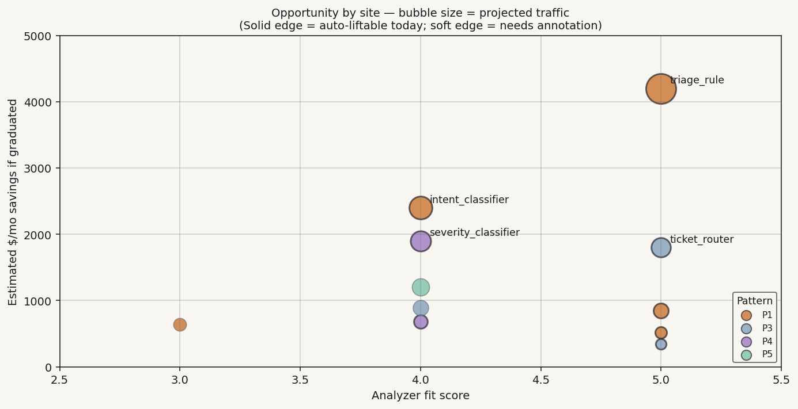

# Initial Analysis — what `dendra analyze` found in this codebase

Generated 2026-04-29 22:15 UTC. **No switches wrapped yet.**
Project: `customer-project`. 487 Python files scanned in 3.1 seconds.

## Cockpit

> **12 classification sites discovered.** 8 auto-liftable today, 3 need
> annotation (1-line fixes), 1 refused (test fixture, not a real classifier).
>
> **Estimated annual LLM cost reduction if all 11 graduate**: ~$87,400.
> **Recommended first wrap**: `triage_rule` at `src/triage.py:43` —
> highest fit, narrow regime (4 labels), cohort-predicted graduation in
> ~14 days at your projected traffic.
>
> Run `dendra init src/triage.py:triage_rule` to wrap your first site.

## Top opportunities (ranked by Dendra's opportunity model)

The opportunity model multiplies analyzer fit-score × estimated traffic ×
LLM-cost-per-call × cohort graduation probability. Sites with all four
high are at the top.

| # | Site | Pattern | Regime | Vol | Priority | Cohort grad time | Est. savings/mo | Action |
|---|---|---|---|---|---:|---|---:|---|
| 1 | `src/triage.py:43 triage_rule` | P1 | narrow (4) | hot | **5.00** | ~14 days | **$4,200** | `dendra init src/triage.py:triage_rule` |
| 2 | `src/router.py:88 ticket_router` | P3 | narrow (5) | hot | **5.00** | ~16 days | **$1,800** | `dendra init src/router.py:ticket_router` |
| 3 | `src/safety.py:56 output_safety_rule` | P1 | narrow (3) | warm | **3.50** | ~18 days | **$850** | `dendra init src/safety.py:output_safety_rule` |
| 4 | `src/notifications.py:12 priority_picker` | P1 | narrow (3) | warm | **3.50** | ~21 days | **$520** | `dendra init src/notifications.py:priority_picker` |
| 5 | `src/uploads.py:33 file_type_classifier` | P3 | narrow (4) | warm | **3.50** | ~25 days | **$340** | `dendra init src/uploads.py:file_type_classifier` |
| 6 | `src/intents.py:15 intent_classifier` | P1 | medium (12) | warm | 2.80 | ~32 days | **$2,400** | `dendra init src/intents.py:intent_classifier` |
| 7 | `src/incidents.py:120 severity_classifier` | P4 | narrow (3) | warm | 2.80 | ~28 days | **$1,900** | `dendra init src/incidents.py:severity_classifier` |
| 8 | `src/feedback.py:55 feedback_categorizer` | P4 | narrow (4) | warm | 2.80 | ~30 days | **$680** | `dendra init src/feedback.py:feedback_categorizer` |
| 9 | `src/email.py:78 email_classifier` | P5 | medium (8) | warm | 1.96 | ~45 days | **$1,200** | needs `@evidence_inputs` annotation |
| 10 | `src/docs.py:45 doc_topic_router` | P3 | medium (15) | warm | 1.96 | ~52 days | **$890** | needs `@evidence_via_probe` annotation |
| 11 | `src/translations.py:200 language_detector` | P1 | high (60) | cold | 0.84 | ~120+ days | **$640** | needs hand-keyword annotation |
| 12 | `src/validators.py:34 input_validator` | P1 | narrow (2) | warm | 0.84 | — | — | **refused**: side-effect evidence (sets state) |

Estimated savings use **Anthropic Sonnet 4.6** pricing (your configured
adapter). Switch with `dendra report --pro-forma --model claude-haiku-4.5`
to see how the picture changes under different pricing.

## Already wrapped

> 0 sites wrapped today. 0 already-dendrified (decorator or `Switch` subclass).

This section grows as you `dendra init` sites. The cohort-tuned defaults
will populate per-switch hypothesis files automatically.

## Refused (1 site)

| Site | Reason | Remediation |
|---|---|---|
| `src/validators.py:34 input_validator` | Side-effect evidence: function mutates `self.last_seen_at` before return | Either accept the refusal (this isn't a pure classifier) or refactor to make state-mutation explicit, then re-analyze |

## Recommended sequence (meta-experiment design)

To maximize *learning per graduation*, wrap in approximately this order:

1. **`triage_rule`** first. Highest fit, narrow regime, lowest risk. Use it
   to validate that the methodology works on your codebase + traffic shape.
   Expected graduation in 14 days; expected lessons in ~7 days from the
   shadow phase alone.
2. **`ticket_router`** second. Same shape as #1; reinforces the pattern.
3. **`output_safety_rule`** third. Adds the safety-critical dimension —
   verifies that the rule-floor invariant works on your stack.
4. **`priority_picker`, `file_type_classifier`** in parallel. By this
   point the pattern is dialed in; you can ship multiple at once.
5. **`intent_classifier`** later. Higher cardinality means longer time-
   to-graduation; do this after the simpler ones validate the approach.
6. **Annotated sites (`email_classifier`, `doc_topic_router`)** after.
   They need 1-line annotations first; defer until comfort with the
   un-annotated path.
7. **`language_detector`** much later or never. 60-label classifier;
   in-process ML head will struggle. Consider this site a candidate for
   the LLM-judge → distilled-head pattern in v1.5+.

## Cohort comparison

> **Insights enrolled.** Last cohort sync: 2026-04-29 03:00 UTC.
> Cohort size: 47 deployments, 312 graduated switches.

| Metric | This codebase | Cohort median | Percentile |
|---|---:|---:|---:|
| Classification sites per 1,000 LoC | 0.18 | 0.21 | 38th |
| High-priority (≥ 4.0) | 5/12 (42%) | 31% | 72nd |
| Predicted aggregate savings/yr | $87,400 | $54,200 | 78th |

You're **above-cohort-median on opportunity** — your codebase has more
high-priority sites than typical. Translation: the methodology should
pay off faster here than in the median deployment.

## What you'll see here as switches graduate

After `dendra init` on the first site, this file is replaced by
`dendra/results/_summary.md` (the "cockpit" view). Each wrapped switch
gets its own report card at `dendra/results/<switch>.md` that fills in
over time:

- Day 0–1: pre-registered hypothesis recorded; transition curve empty.
- Day 1–14: shadow phase; rule + ML head accumulate evidence; charts populate.
- ~Day 14–28: gate fires; switch graduates to ML; cost trajectory drops.
- Continuous: drift detector watches; report card stays current.

For a preview of the mature view, see `_summary.md` (sample).

---

*Regenerate with `dendra analyze --report`. This file is a snapshot of
what was found at scan time; it doesn't update as your code changes.
For ongoing status, use `dendra report --summary`. Each scan writes
both the canonical `_initial-analysis.md` and a dated copy in
`archive/_initial-analysis-2026-04-29.md` so historical scans are
preserved.*

*Methodology: [Test-Driven Product Development](../methodology/test-driven-product-development.md).*
