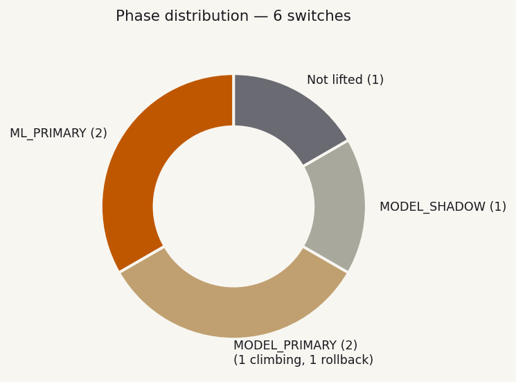
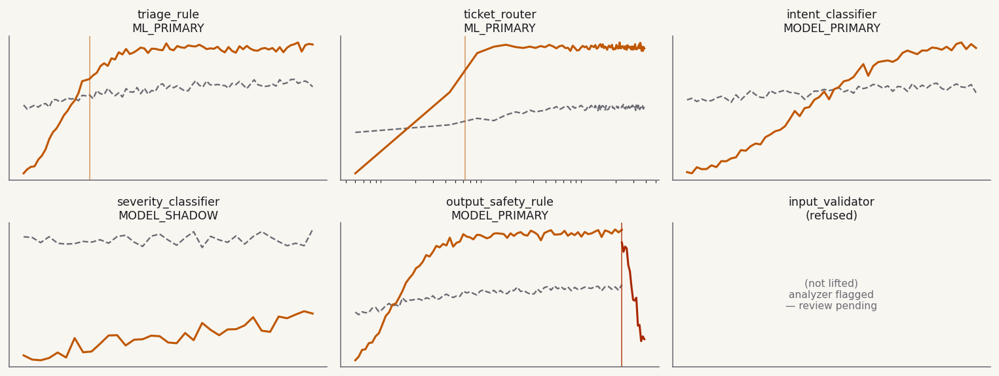
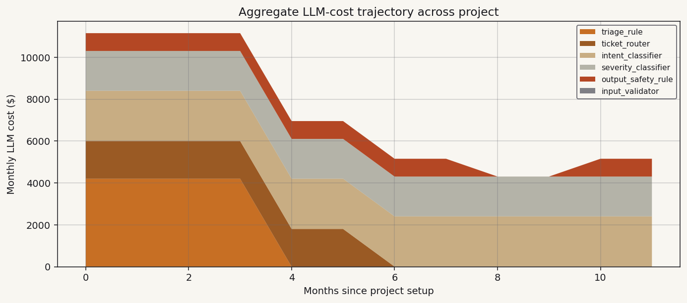

# Project Switches — Status Summary

Generated 2026-04-29 22:15 UTC.
Project: `dendra-trial`. 6 switches across 3 source files.
Last drift check: 2026-04-29 22:14 UTC.

## Cockpit

> **Aggregate cost reduction this month: $4,200 saved**
> (≈27% of projected reduction once all eligible switches graduate).
>
> Phase breakdown: 2 in `ML_PRIMARY` (graduated cleanly).
> 2 in `MODEL_PRIMARY` (1 climbing toward graduation, 1 re-evaluating
> after a drift event). 1 in `MODEL_SHADOW` (gate-fire predicted in
> 14–23 days). 1 not lifted (analyzer refused; user review required).
>
> **1 action required: drift event on `output_safety_rule`** — see
> [its report card](output_safety_rule.md) for the diff and re-graduation steps.

## Phase distribution

## Switch grid

Each panel is a transition curve at the same accuracy axis.
Click any switch name in the table below to drill into its full report card.

## Aggregate cost trajectory

The two graduations dropped the project's total monthly LLM bill by $5,997.
The drift event on `output_safety_rule` re-introduced ~$850/month until
re-graduation lands. Three remaining switches (`intent_classifier`,
`severity_classifier`, `input_validator`) are pre-graduation — graduating
them is projected to remove an additional ~$4,300/month from the bill.

## Per-switch status

| Switch | Phase | Outcomes | Gate p | $ saved /mo | Drift | Report |
|---|---|---:|---:|---:|---|---|
| `triage_rule` | `ML_PRIMARY` | 1,247 | < 1e-15 | **$4,197** | clean | [→](triage_rule.md) |
| `ticket_router` | `ML_PRIMARY` | 38,400 | < 1e-15 | **$1,798** | clean | (per-switch card omitted) |
| `intent_classifier` | `MODEL_PRIMARY` | 720 | 0.024 | (climbing) | clean | (per-switch card omitted) |
| `severity_classifier` | `MODEL_SHADOW` | 145 | 0.087 | (pre-grad) | clean | [→](severity_classifier.md) |
| `output_safety_rule` | `MODEL_PRIMARY` (rollback) | 1,023 | — | (lost; re-graduating) | **DRIFT** | [→](output_safety_rule.md) |
| `input_validator` | (not lifted) | — | — | — | n/a | (per-switch card omitted) |

## Hypothesis-vs-observed roll-up

Each switch's report card has a pre-registered hypothesis. The project-level roll-up:

| Hypothesis dimension | Confirmed | Refused | In flight | Total |
|---|---:|---:|---:|---:|
| Graduation depth in predicted interval | 2 | 0 | 1 | 3 |
| Effect size ≥ pre-registered threshold | 2 | 0 | 1 | 3 |
| Gate cleared at α = 0.01 | 2 | 0 | 1 | 3 |
| Drift handling (auto-rollback) | 1 | 0 | 0 | 1 |

All in-flight hypotheses are pre-registered with content-hashes in
`dendra/hypotheses/` and are observable in this project's git history.
Confirmed hypotheses can be exported as a signed PDF via
`dendra report --export-pdf` (Hosted Business tier).

## Cohort comparison

> **Insights enrolled.** Last cohort sync: 2026-04-29 03:00 UTC.
> Cohort size: 47 deployments, 312 graduated switches.

| Metric | This project | Cohort median | Cohort 90% CI |
|---|---:|---:|---:|
| Time to graduation (outcomes) | 312 (triage), 620 (ticket) | 287 | 198–413 |
| Effect size at graduation (pp) | 8.8, 11.2 | 7.4 | 4.1–14.6 |
| Drift events per 30 days | 1 (per 6 switches) | 0.3 | 0–2 |

You're slightly slower-to-graduate than cohort median (likely because your
traffic is more class-balanced; cohort skews toward 5–10 dominant labels).
Effect-size and drift-rate are both within typical bounds.

## Drift watch

| Switch | Status | Last drift | Action |
|---|---|---|---|
| `output_safety_rule` | **action required** | 2026-04-28 14:23 UTC | review diff in [report card](output_safety_rule.md) |

Other switches: clean.

## Pending hypotheses (gate-fire predicted)

| Switch | Predicted graduation | At current traffic |
|---|---|---|
| `severity_classifier` | outcome 287–413 (90% CI) | 14–23 days |
| `intent_classifier` | outcome 800–1,100 (90% CI) | 8–15 days |

---

*Regenerate with `dendra report --summary`. Per-switch deep-dives live
alongside this file in `dendra/results/`. Each `--summary`
regeneration writes both the canonical `_summary.md` and a dated copy
under `dendra/results/archive/` so historical snapshots are preserved
for compliance.*

*Methodology: [Test-Driven Product Development](../methodology/test-driven-product-development.md).*
