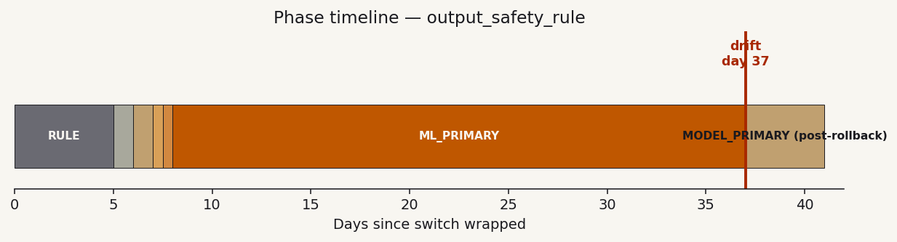
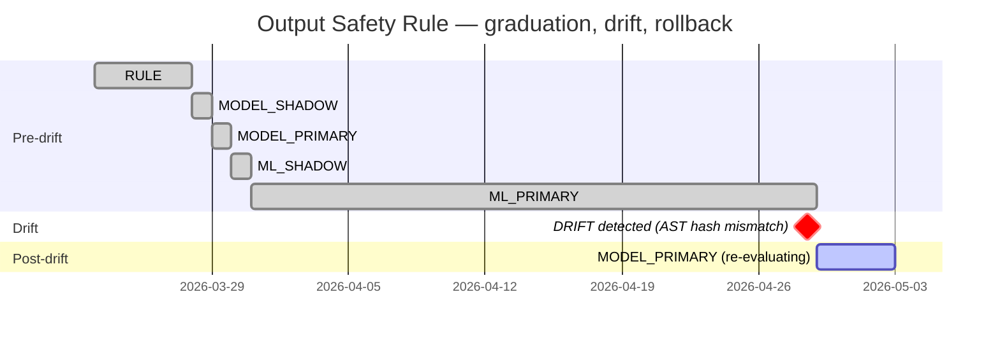
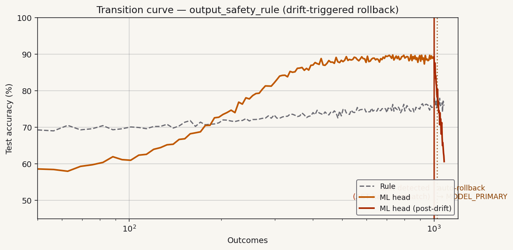

# Output Safety Rule — Graduation Report Card

Generated 2026-04-29 22:15 UTC.
Site: `src/safety.py:output_safety_rule`. Fingerprint: `c0ffee8b4d2f1a90`.

## Status

> **Phase: `MODEL_PRIMARY`** (rolled back from `ML_PRIMARY`).
> The site graduated cleanly at outcome 280 (day 8) and ran in
> `ML_PRIMARY` for 29 days. On day 37 the AST-hash drift detector
> flagged a function-body change, and the circuit breaker
> auto-rolled back to `MODEL_PRIMARY` after observing 23 verdicts
> with ML accuracy 25 pp below the pre-drift baseline.
>
> The rule is back in primary. Re-graduation is gated on the user
> reviewing the source change and re-confirming the hypothesis
> (or accepting the existing one) — see "Action required" below.

## Phase timeline





## Transition curve



The graduated trajectory (left) shows the clean graduation at
outcome 280 with sustained 87% ML accuracy through outcome 1000.
At outcome 1000 (day 37) the AST hash check flagged a change
to the function body. The post-drift trajectory (red, right)
shows ML accuracy collapsing to ~62% over the next 23 verdicts,
crossing the auto-rollback threshold (rule beating ML by ≥ 10 pp
sustained over 20 verdicts). Auto-rollback fired at outcome 1023.

## What changed

Drift detector compared the AST hash from initialization
(`5f8c1d2e3a9b7c4f`) against the current AST hash
(`9d4a2c7b8e1f6053`). The function `output_safety_rule` was
modified at 2026-04-28 14:23 UTC, between two ordinary git commits.

The diff (computed locally; not phoned home):

```diff
 def output_safety_rule(payload):
-    if payload.confidence < 0.6:
+    if payload.confidence < 0.5:
         return "review"
     if "blocklist" in payload.flags:
         return "block"
     return "allow"
```

The threshold change shifted the rule's decision boundary; the
ML head was trained on the old distribution and its predictions
no longer match the new ground truth. **This is exactly what the
drift detector is for.**

## Action required

1. **Review the diff.** Confirm that the threshold change is
   intentional. (If unintentional, revert and re-evaluate.)
2. **Re-confirm the hypothesis.** Open
   `dendra/hypotheses/output_safety_rule.md`
   and either accept the existing claims (the new behavior is
   close enough to the old that the model may re-graduate similarly)
   or revise them with explanation. Either path is logged in git.
3. **Re-graduate.** Once the hypothesis is confirmed/revised, the
   site re-enters its normal lifecycle starting from `MODEL_PRIMARY`.
   Expected to re-graduate within ~50–100 outcomes since the rule
   is largely the same shape; the ML head will retrain on
   accumulated post-drift verdicts.

## Hypothesis evidence (post-drift)

| Predicted (pre-drift) | Observed (pre-drift) | Verdict |
|---|---|---|
| Graduation: 250–500 outcomes | 280 outcomes | ✓ |
| Effect size: ≥ 4 pp | 9.1 pp | ✓ |
| Drift handling | Auto-rollback at 1023 | ✓ Mechanism worked |

## Raw checkpoints (recent)

| Outcome | Rule acc | ML acc | Δ | Phase |
|---:|---:|---:|---:|---|
| 1000 | 76.5% | 87.5% | +11.0 | ML_PRIMARY (drift) |
| 1005 | 76.4% | 79.2% | +2.8 | ML_PRIMARY |
| 1010 | 76.7% | 71.5% | -5.2 | ML_PRIMARY (warning) |
| 1015 | 76.5% | 66.8% | -9.7 | ML_PRIMARY (warning) |
| 1020 | 76.6% | 63.4% | -13.2 | ML_PRIMARY (rollback armed) |
| **1023** | **76.7%** | **62.1%** | **-14.6** | **MODEL_PRIMARY** ← rolled back |

---

*Regenerate with `dendra report output_safety_rule`. Drift detected
2026-04-28 14:23 UTC. Rollback executed 2026-04-29 03:11 UTC. Dated
archive at `dendra/results/archive/output_safety_rule-2026-04-29.md`.*

*Methodology: [Test-Driven Product Development](../methodology/test-driven-product-development.md).*
