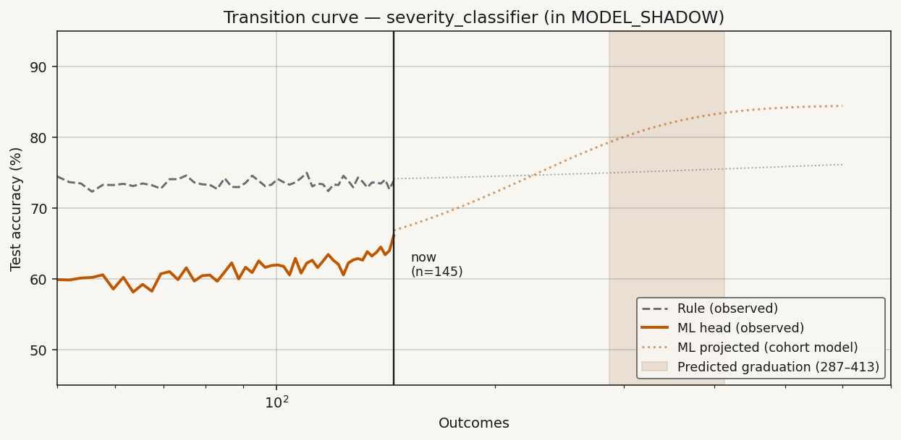
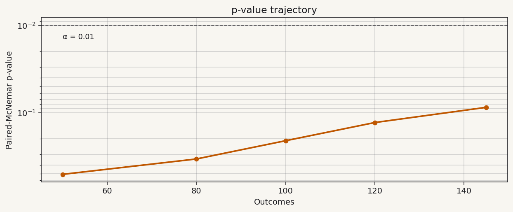
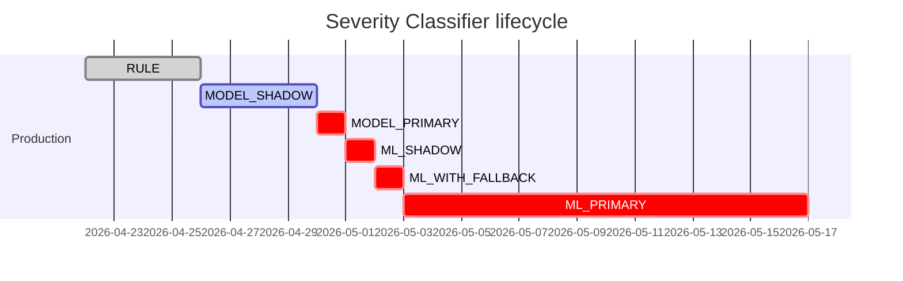

# Severity Classifier — Graduation Report Card

Generated 2026-04-29 22:15 UTC.
Site: `src/incidents.py:severity_classifier`. Fingerprint: `f4e3d2c1b09a8765`.

## Status

> **Phase: `MODEL_SHADOW`** — accumulating evidence.
> 145 outcomes recorded. Gate (`McNemarGate`, α = 0.01)
> currently at p = **0.087**.
> ML head currently 0.4 pp ahead of rule — not yet statistically
> significant. Cohort model predicts graduation at outcome
> **287–413** (90% CI), so we expect the gate to fire in
> approximately **14–23 more days** at current traffic.

## Transition curve

The dotted lines projecting forward are the cohort model's prediction
for what this site's curves look like by outcome 600. The shaded
band is the gate-fire prediction interval. If observed trajectory
falls outside this band, that's a signal that this site is
structurally different from the cohort and may need explicit
annotation (`@evidence_inputs`, etc.) — see the hypothesis file
for the analyzer's pre-registered diagnostic plan.

## p-value trajectory

The trajectory is monotone-decreasing as expected, but hasn't cleared
α = 0.01 yet. Gate-fire candidate checkpoints are every 50 outcomes;
the next checkpoint is at 200.

## Phase timeline

(Bars marked `crit` are projected; not yet entered.)

## Cost trajectory

| | Current | Projected post-graduation |
|---|---:|---:|
| Per call | $0.0019 | ~$0.000003 |
| Per 1M calls | $1,900.00 | $3.00 |
| Latency p50 | 280 ms | <1 ms |

> **No graduation has fired yet.** Cost-reduction figures above are
> projections. Use `dendra report severity_classifier --pro-forma` to
> see modelled outcomes if you graduate this site under different
> traffic shapes.

## Hypothesis evidence (in-flight)

The pre-registered hypothesis at
`dendra/hypotheses/severity_classifier.md`
predicted graduation at outcome 250–500, effect size ≥ 3 pp.

| Predicted | Observed-so-far | Verdict |
|---|---|---|
| Graduation depth: 250–500 outcomes | n=145, gate not cleared | (in flight) |
| Effect size: ≥ 3 pp | +0.4 pp | (insufficient) |
| p < 0.01 at first clear | 0.087 | (not cleared) |

Verdict will populate once the gate fires (or the timeout at 1000
outcomes triggers a "did not graduate within budget" outcome,
which would be a signal to re-examine the rule + ML head choice).

## Raw checkpoints

| Outcome | Rule acc | ML acc | McNemar p | Phase |
|---:|---:|---:|---:|---|
| 50 | 73.0% | 56.0% | 0.510 | RULE |
| 80 | 74.5% | 64.2% | 0.342 | RULE |
| 100 | 75.1% | 70.4% | 0.214 | MODEL_SHADOW |
| 120 | 75.6% | 73.8% | 0.131 | MODEL_SHADOW |
| **145** | **76.0%** | **76.4%** | **0.087** | **MODEL_SHADOW** |

---

*Regenerate with `dendra report severity_classifier`. Last drift check:
2026-04-29 22:14 UTC, no drift detected. Dated archive at
`dendra/results/archive/severity_classifier-2026-04-29.md`.*

*Methodology: [Test-Driven Product Development](../methodology/test-driven-product-development.md).*
