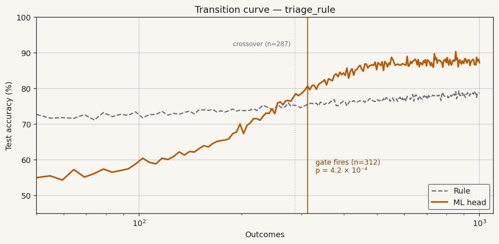
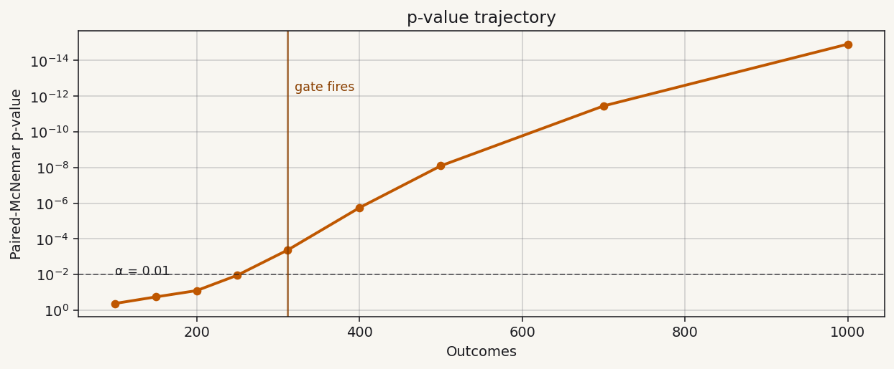
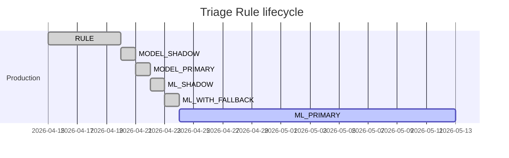
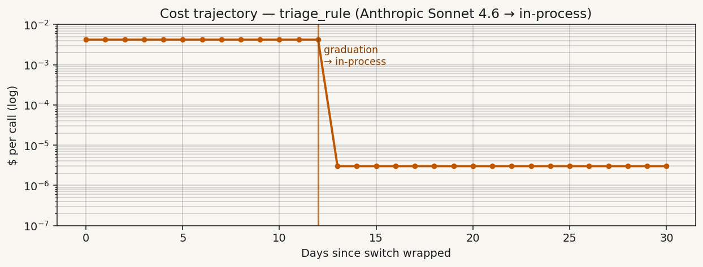

# Triage Rule — Graduation Report Card

Generated 2026-04-29 22:15 UTC.
Site: `src/triage.py:triage_rule`. Fingerprint: `a1b2c3d4ef567890`.

## Status

> **Phase: `ML_PRIMARY`** — graduated 2026-04-25 at outcome 312.
> Gate (`McNemarGate`, α = 0.01) fired with p = **4.2 × 10⁻⁴**.
> Effect size: rule 78.4% → ML 87.2% (**+8.8 pp**).
> Cost per call: **$0.0042 → $0.000003** (99.93% reduction).

## Transition curve

The crossover (where ML first overtakes the rule) was at outcome 287.
The gate fires at 312 — **the gate measures evidence sufficiency, not
crossover**; the 25-outcome lag is the cost of paired-McNemar at
α = 0.01. See [methodology](../methodology/test-driven-product-development.md).

## p-value trajectory

The dashed line at p = 0.01 is the configured gate threshold. The trajectory
clears α at outcome 312 and continues monotone-strict-decreasing,
which is the signal we look for to confirm the graduation isn't a
sampling fluke. By outcome 1000 the p-value is below 10⁻¹⁵ —
overwhelming evidence the ML head genuinely outperforms the rule
on this site's traffic distribution.

## Phase timeline

## Cost trajectory

| | Pre-graduation | Post-graduation | Reduction |
|---|---:|---:|---:|
| Per call | $0.0042 | $0.000003 | 99.93% |
| Per 1M calls | $4,200.00 | $3.00 | $4,197 |
| Latency p50 | 412 ms | 0.8 ms | 99.81% |

> **What-if: model substitution.** Re-run with `postrule report triage_rule
> --model claude-haiku-4.5` to see this site's pre-graduation cost on a
> different LLM. Re-run with `--model gpt-5-mini` for OpenAI pricing.
> Useful as a pro-forma when sizing your AI budget *before* graduation.

## Hypothesis evidence

The pre-registered hypothesis at `postrule/hypotheses/triage_rule.md`
(generated by `postrule init` at the time of wrapping) predicted
graduation at outcome 250–500, effect size ≥ 5 pp.

| Predicted | Observed | Verdict |
|---|---|---|
| Graduation depth: 250–500 outcomes | 312 outcomes | ✓ Within interval |
| Effect size: ≥ 5 pp | 8.8 pp | ✓ Exceeded |
| p < 0.01 at first clear | 4.2 × 10⁻⁴ | ✓ Cleared |
| No drift events post-graduation | 0 events in 19 days | ✓ Clean |

## Raw checkpoints

| Outcome | Rule acc | ML acc | McNemar p | Phase |
|---:|---:|---:|---:|---|
| 100 | 71.0% | 64.3% | 0.413 | RULE |
| 150 | 73.2% | 73.6% | 0.184 | MODEL_SHADOW |
| 200 | 74.5% | 81.1% | 0.024 | MODEL_SHADOW |
| 250 | 77.6% | 83.6% | 0.011 | MODEL_PRIMARY |
| **312** | **78.4%** | **87.2%** | **4.2 × 10⁻⁴** | **ML_PRIMARY** ← gate |
| 400 | 78.7% | 87.5% | 1.8 × 10⁻⁶ | ML_PRIMARY |
| 500 | 79.1% | 87.9% | 8.0 × 10⁻⁹ | ML_PRIMARY |
| 700 | 79.2% | 88.1% | 3.5 × 10⁻¹² | ML_PRIMARY |
| 1000 | 79.3% | 88.4% | 1.2 × 10⁻¹⁵ | ML_PRIMARY |

---

*Regenerate with `postrule report triage_rule`. Last drift check:
2026-04-29 22:14 UTC, no drift detected. Dated archive at
`postrule/results/archive/triage_rule-2026-04-29.md` (rotation
preserves historical snapshots so a graduation event you can show
your auditor stays committed even after re-renders).*

*Methodology: [Test-Driven Product Development](../methodology/test-driven-product-development.md).*
