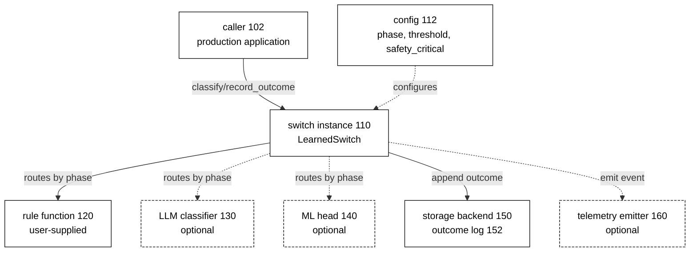
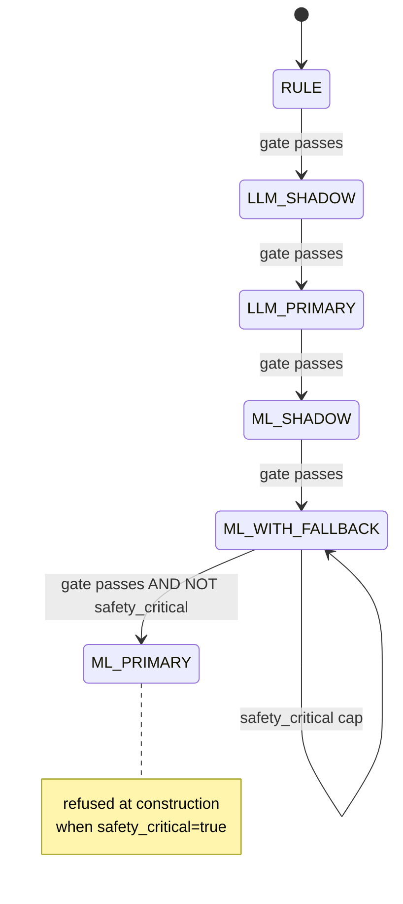
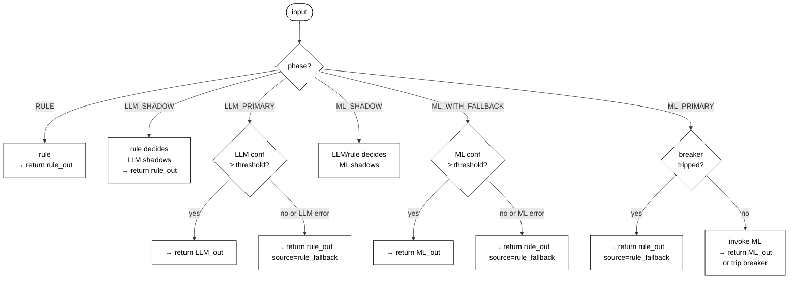
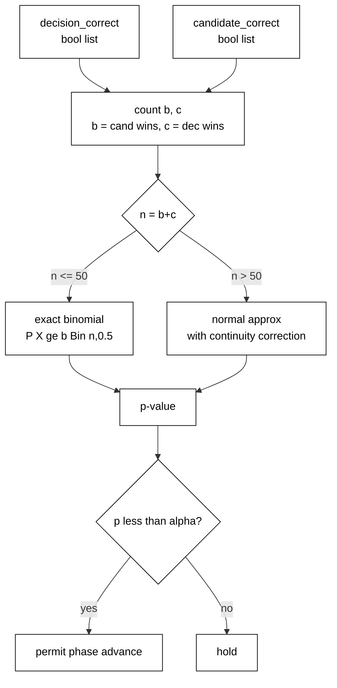
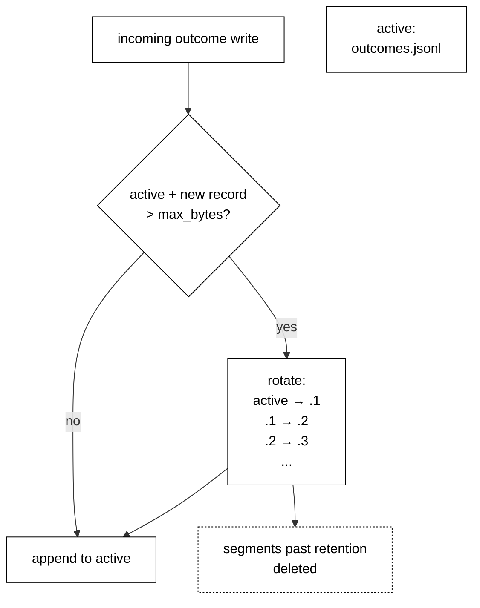
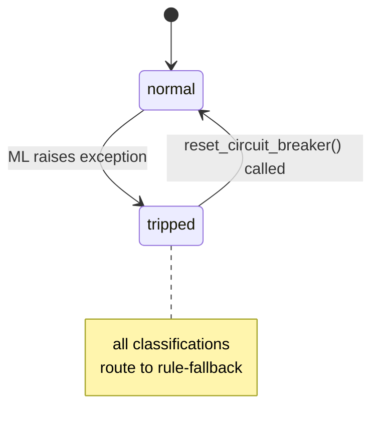
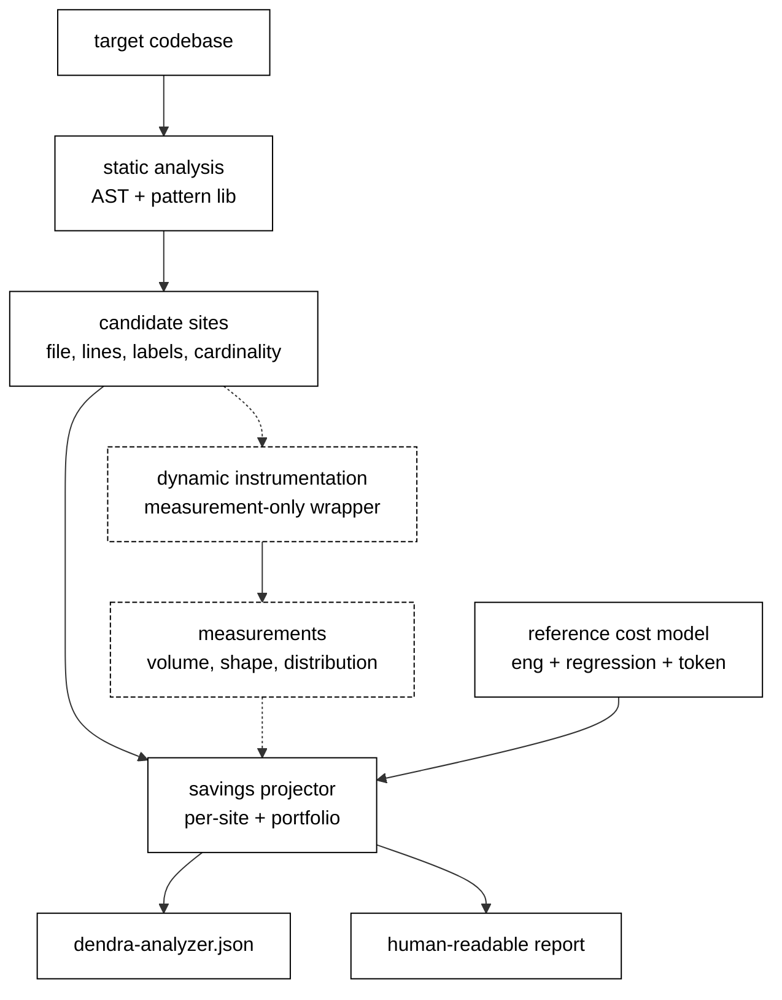
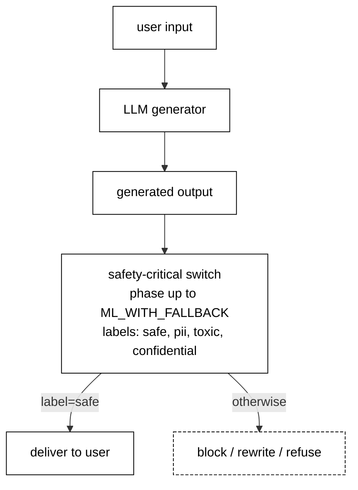

# Drawings for the Dendra Provisional Patent Application

**Eight figures.** Each is described in text below plus a Mermaid
diagram source you can render at [mermaid.live](https://mermaid.live),
export as SVG, and convert to PDF for the filing.

**USPTO drawing requirements (summary):**
- Black-and-white line drawings on white background.
- Each figure on a separate page.
- Figure numbers labeled "FIG. 1", "FIG. 2", etc.
- Reference numerals cited in the specification (optional but
  standard practice).

---

## FIG. 1 — Overall system architecture

**Description:** A block diagram showing the graduated-autonomy
classification system 100, comprising a switch instance 110
mediating between a caller 102 and a decision-making chain of
rule function 120, optional LLM classifier 130, and optional ML
head 140. Configuration record 112 controls the switch. Storage
backend 150 maintains outcome log 152. Telemetry emitter 160
receives observation events.

---

## FIG. 2 — Six-phase state machine

**Description:** An ordered sequence of six states {RULE,
LLM_SHADOW, LLM_PRIMARY, ML_SHADOW, ML_WITH_FALLBACK, ML_PRIMARY}.
Each forward transition is gated by a statistical test (§5.5). A
regression (backward) transition is permitted at operator
discretion. Safety-critical switches cannot enter ML_PRIMARY.

---

## FIG. 3 — Classification decision flow per phase

**Description:** A decision tree showing, for a single input,
which components are invoked in each of the six phases, and
which component's output is returned to the caller.

---

## FIG. 4 — Statistical transition gate

**Description:** The gate's input is two parallel lists of boolean
correctness indicators — one for the current decision-maker, one
for the candidate higher-tier. Output is a one-sided p-value; if
below α, phase may advance.

---

## FIG. 5 — Self-rotating storage layout

**Description:** On-disk layout of the outcome log for a single
switch. The active segment receives new writes; on threshold
cross, it becomes the most-recent rotated segment and older
segments shift up by one index. Segments beyond the retention cap
are deleted.

---

## FIG. 6 — Circuit breaker state machine

**Description:** Two states (normal, tripped). ML exception in
normal state triggers transition to tripped. Explicit reset
returns to normal. No automatic recovery in the preferred
embodiment (optional half-open state in alternative embodiments).

---

## FIG. 7 — Analyzer pipeline

**Description:** Three-stage pipeline: static analysis of the
target codebase, optional dynamic instrumentation with measurement,
and savings projection combining both with a reference cost model.
Outputs are machine-readable JSON + human-readable Markdown.

---

## FIG. 8 — Output-safety integration (Property 7)

**Description:** The invention applied to classification of
LLM-generated output before delivery to users. User input →
generator → output → classification gate → delivery (or
refusal/rewrite). The gate is a safety-critical switch in
phase RULE (or later, up to ML_WITH_FALLBACK), with phase
ML_PRIMARY refused at construction.

---

## Rendering workflow

1. For each figure above, copy the Mermaid source into
   [mermaid.live](https://mermaid.live).
2. Use the "Actions → Download SVG" button.
3. Open each SVG in a browser, Print → Save as PDF.
4. Label each output file "FIG-1.pdf", "FIG-2.pdf", etc.
5. Combine into a single "drawings.pdf" or attach separately
   per USPTO filing instructions.

## Alternative: hand-drawn

USPTO accepts hand-drawn line drawings. If time-constrained and
Mermaid rendering gives any trouble, a clean pen-on-paper sketch
of each figure also satisfies the drawing requirement. Scan at
300 DPI minimum, convert to PDF, include in the packet. Add the
figure number ("FIG. 1") in the margin.

---

_Drawings prepared 2026-04-20 for the Dendra provisional.
Reference numerals correspond to the specification's §5._
